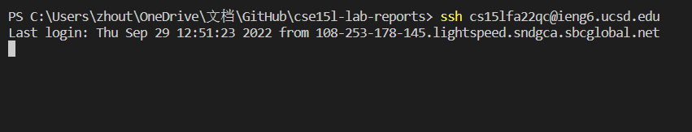
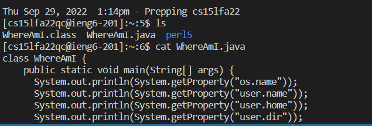
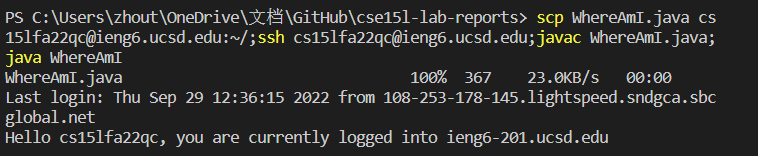
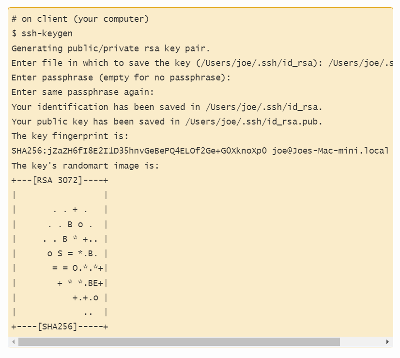
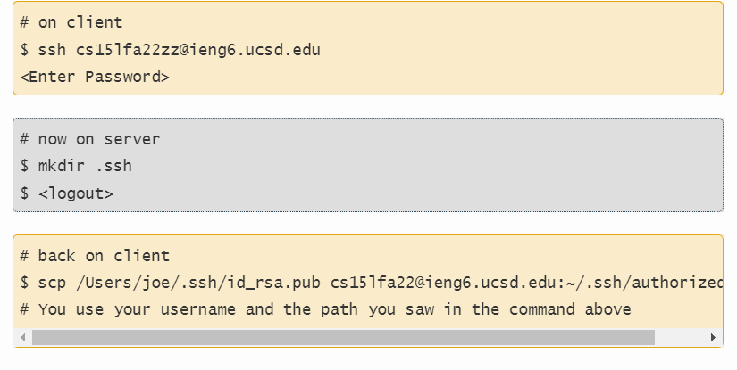
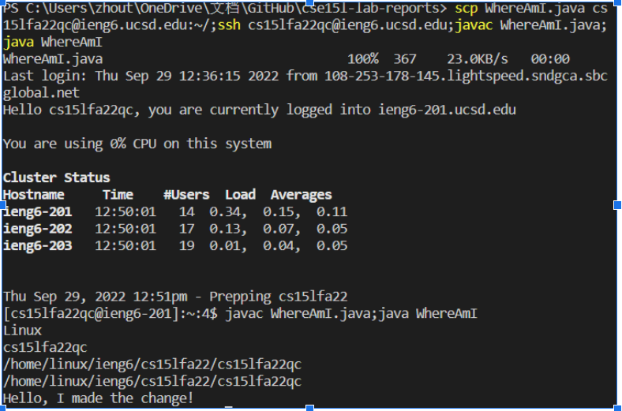

In this lab report, I will teach you how to make a remote access. 
1. we need to download the VScode through the offical website of visual code.

[https://code.visualstudio.com/](https://code.visualstudio.com/)

2. we will do the remot connect through code "*ssh cs15lfa22qc@ieng6.ucsd.edu*"

    Also, we need to enter the password for the log in process. However, becuase I have already set the key, I can skip this process.

3. After we logged in, we can use command  "*cat*" to concatenate the content of specific file. "*ls*" command can help us to kown what file we have in which directory. 

4. Then use the "*scp + filename + cs15lfa22qc@ieng6.ucsd.edu:~/*" to copy the file form local server to the remote server. Also, you can use semicolone to continue the command in one line with ssh log in.

5. We can also set a key to ignore the step for scp and ssh to enter the password. This will save us a lot of time. 

this is the code for the key, save the file into the directory.
Just press enter for the whole process.

In this case, whenever you are trying to use the scp and ssh, you don't need a password.

6. Finally, As I said, you can use the semicolone to speed up the process of remote server. I use copy and paste for all the commands and use semicolons to separate the command. I found that it has to be separated into two steps for the scp/ssh and javac/java instead of doing them in one line.

That's all