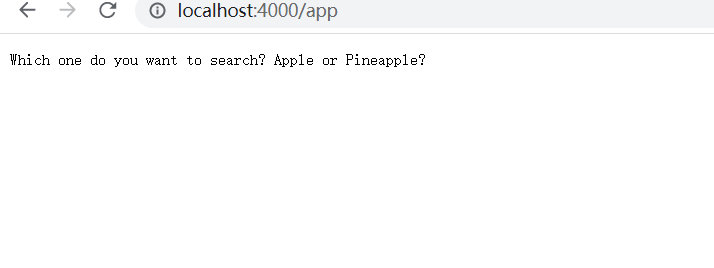
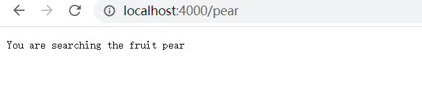
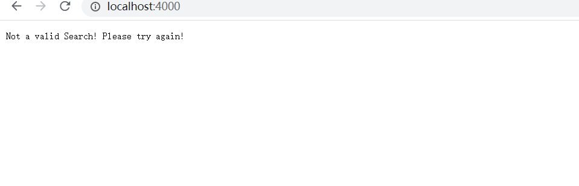

# Part 1- Searching Engine

## raw code for my searching engine
```import java.io.IOException;
import java.net.URI;

class Handler implements URLHandler {
    // The one bit of state on the server: a number that will be manipulated by
    // various requests.


    public String handleRequest(URI url) {
        if (url.getPath().equals("/")) {
            return String.format("Not a valid Search! Please try again!");
        } else if (url.getPath().equals("/apple")) {

            return String.format("You are searching the fruit Apple");
        } 
        else if (url.getPath().equals("/Pineapple")) {

            return String.format("You are searching the fruit pineapple");
        }
        else if (url.getPath().equals("/app")) {

            return String.format("Which one do you want to search? Apple or Pineapple?");
        }
        else if (url.getPath().equals("/pear")) {

            return String.format("You are searching the fruit pear");
        }
        else if (url.getPath().equals("/blueberry")) {

            return String.format("You are searching the fruit blueberry");
        }else {
            return "404 Not Found!";
        }
    }
}

class SearchEngine {
    public static void main(String[] args) throws IOException {
        if(args.length == 0){
            System.out.println("Missing port number! Try any number between 1024 to 49151");
            return;
        }

        int port = Integer.parseInt(args[0]);

        Server.start(port, new Handler());
    }
}
```
## Screenshots for my searching engine
### 1.

For this first searching, I called
```
else if (url.getPath().equals("/app")) {

            return String.format("Which one do you want to search? Apple or Pineapple?");
        }
```
I use the easy way both for me to write and for people to search. They just need to search for app, they will be ask to search either apple or pineapple. Hence, they can search for what they want.
### 2.

For this first searching, I called
```
else if (url.getPath().equals("/pear")) {

            return String.format("You are searching the fruit pear");
        }
```
I use the easy way both for me to write and for people to search. They just need to search for pear, and the searching engine will reply that "You are searching the fruit pear".
### 3.

```
if (url.getPath().equals("/")) {
            return String.format("Not a valid Search! Please try again!");
```
However, if they are not searching anything, I will just let them to reenter the value which is valid. Hence, I print "Not a valid Search! Please try again!" to warn them.


# Part 2- Debugg
## 1. bug in ArrayExamples.java
### reversed method

(just to be cleared, all the screenshots are after I fixed the bug!)
In this picture, original version doesn't have the line newArray = arr.clon(). In this case, the first linke of the method will just create a new integer list with the length of arr but completely empty in it. Hence, when we call the for loop to iterate over the whole list and set arr[i] = newArray[arr.length - i - 1], we will not going to the loop beucase the list is empty. Hence, when we return arr, we will just get what we input. However, since I have add the method .clone() to give the new list some contenet, the method reversed can be functional.


## 2. bug in ListExamples.java
### filter method

(just to be cleared, all the screenshots are after I fixed the bug!)
In this method, the original method was missing the interface. Without the interface, we cannot even call the method. Also, the if statement also missed == sign to prove that the filter return true. If we don't have == true, we will loop forever and put all the element into result. Hence, I wrote the interface right below.


To test the method, I also write a long test to see if this method will work normally!

Glad that this method passed the test.
