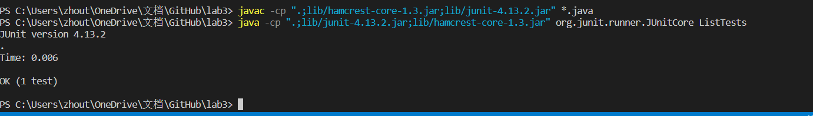

# Part 1- Searching Engine

## raw code for my searching engine
```
import java.io.IOException;
import java.net.URI;

class Handler implements URLHandler {
    // The one bit of state on the server: a number that will be manipulated by
    // various requests.
    String fruit = null;

    public String handleRequest(URI url) {
        if (url.getPath().equals("/")) {
            return String.format("fruit %s", fruit);
        } else {
            System.out.println("Path: " + url.getPath());
            if (url.getPath().contains("/add")) {
                String[] parameters = url.getQuery().split("=");
                if (parameters[0].equals("s")) {
                    fruit = (String)parameters[1];
                    return String.format("the fruit is now %s",fruit);
                }
            }
            if (url.getPath().contains("/search")) {
                String[] parameters = url.getQuery().split("=");
                if (parameters[0].equals("s")) {
                    fruit = (String)parameters[1];
                    return String.format("the fruit is now %s",fruit);
                }
            }
            return "404 Not Found!";
        }
    }
}

class NumberServer {
    public static void main(String[] args) throws IOException {
        if(args.length == 0){
            System.out.println("Missing port number! Try any number between 1024 to 49151");
            return;
        }

        int port = Integer.parseInt(args[0]);

        Server.start(port, new Handler());
    }
}
```
### screenshot 1

For this one, the line called is
```
if (url.getPath().equals("/")) {
            return String.format("fruit %s", fruit);
```
The arg is / since this is the simplest one. There is no other change form. Becuase if we are searching nothing, it should return fruit null. Null means nothing.
### screenshot 2

For this one, the line called is
```
System.out.println("Path: " + url.getPath());
            if (url.getPath().contains("/add")) {
                String[] parameters = url.getQuery().split("=");
                if (parameters[0].equals("s")) {
                    fruit = (String)parameters[1];
                    return String.format("the fruit is now %s",fruit);
                }
            }
```
The arg is /add?s=apple. The parameter[0] is s. Only if the first part split by = is s, the method will work. In addition it will store the parameter[1] into a string variable called fruit. When we put apple as a arg, it will return the fruit is now apple. Hence, no matter what fruit we input, it will return on the webpage.

### screenshot 3

For this one, the line called is
```
if (url.getPath().contains("/search")) {
                String[] parameters = url.getQuery().split("=");
                if (parameters[0].equals("s")) {
                    fruit = (String)parameters[1];
                    return String.format("the fruit is now %s",fruit);
                }
            }
```
The arg is /search?s=apple. The parameter[0] is s. Only if the first part split by = is s, the method will work. In addition it will store the parameter[1] into a string variable called fruit. When we put pear as a arg, it will return the fruit is now pear. Hence, no matter what fruit we input, it will return on the webpage.

### screenshot 4

For this one, the line called is
```
return "404 Not Found!";
```
This is simply if we are not inputting the right query or sytax. It will return 404 not found.
# Part 2- Debugg
## 1. bug in ArrayExamples.java
### reversed method

## I am so sorry that I can not find the original file.So that I cannot do the screenshot for syptoms. But the only bug here is that the lin 15 create an empty list. Hence, the system just skip the for loop and print arr.

(just to be cleared, all the screenshots are after I fixed the bug!)
In this picture, original version doesn't have the line newArray = arr.clon(). In this case, the first linke of the method will just create a new integer list with the length of arr but completely empty in it. Hence, when we call the for loop to iterate over the whole list and set arr[i] = newArray[arr.length - i - 1], we will not going to the loop beucase the list is empty. Hence, when we return arr, we will just get what we input. However, since I have add the method .clone() to give the new list some contenet, the method reversed can be functional.


## 2. bug in ListExamples.java
### filter method

## I am so sorry that I can not find the original file.So that I cannot do the screenshot for syptoms. But the bugs here is firt in the if statement, we need == true. Second, we actually need to write a interface with method StringChecker. Or this file will not run.

(just to be cleared, all the screenshots are after I fixed the bug!)
In this method, the original method was missing the interface. Without the interface, we cannot even call the method. Also, the if statement also missed == sign to prove that the filter return true. If we don't have == true, we will loop forever and put all the element into result. Hence, I wrote the interface right below.


To test the method, I also write a long test to see if this method will work normally!

Glad that this method passed the test.
