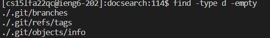

In this lab report, I will show 3 of the useage of find with three example 
## the fisrt one, to find the empty file or directory
### 1
```
find ./ -size 0
```
this is a find command to check if there is any empty files in the dirctory of technical


In the picture above, we can see that this command does not return anything. This is becuase we do not have any empty files under the techical directory. This can be a very useful command since if we want to check if there is some useless files which are empty, and we can delete them.

### 2
```
find -type f -empty # -type
```
this command help use to find the empty file under the techincal.


As we can see in the picture above that there is no such file so that each file has something in it. The different with this two command is that we use the -empty variable instead of the -size variable.

### 3
```
find -type d -empty
```
this command help use to find the empty dirctory under the techincal.


As we can see in the picture above that there is no such dirctory so that each directory has something in it.


However, as we can see, under the docsearch file, we have three empty dirctories. 

### 4
```
find -name "chapter-1.txt" |xargs rm -f

find -name "1468-6708-3-1.txt" |xargs rm -f

find -name "chapter-2.txt" -delete
```

These command is the command lines to find the file with sepecific name first. then remove them using xarges and rm -f.
This can be very useful if we know the file name and remove them.
For example, if we do not want chapter-1.txt, we can just use this command to remove it from technical.
Instead of rm -f, we can use -delete variable.
there will be no output since it's only deletion.

### 5
```
[cs15lfa22qc@ieng6-202]:technical:120$ find ./ ! -newer chapter-1.txt |xargs ls -al
find: 'chapter-1.txt': No such file or directory
total 104
drwxr-s--- 6 cs15lfa22qc ieng6_cs15lfa22  4096 Oct 20 10:18 .
drwxr-s--- 5 cs15lfa22qc ieng6_cs15lfa22  4096 Oct 20 11:14 ..
drwxr-s--- 2 cs15lfa22qc ieng6_cs15lfa22  4096 Oct 30 23:05 911report
drwxr-s--- 2 cs15lfa22qc ieng6_cs15lfa22 65536 Oct 20 10:18 biomed
drwxr-s--- 8 cs15lfa22qc ieng6_cs15lfa22  4096 Oct 20 10:18 government
drwxr-s--- 2 cs15lfa22qc ieng6_cs15lfa22 20480 Oct 20 10:18 plos
```

This is a find command to finde the files that are newer than the finding file. For example, if we want to find file that newer than chapter-1.txt, we use this command. Hence, it is very useful.

```
[cs15lfa22qc@ieng6-202]:technical:121$ find ./ -newer chapter-1.txt |xargs ls -al
find: 'chapter-1.txt': No such file or directory
total 104
drwxr-s--- 6 cs15lfa22qc ieng6_cs15lfa22  4096 Oct 20 10:18 .
drwxr-s--- 5 cs15lfa22qc ieng6_cs15lfa22  4096 Oct 20 11:14 ..
drwxr-s--- 2 cs15lfa22qc ieng6_cs15lfa22  4096 Oct 30 23:05 911report
drwxr-s--- 2 cs15lfa22qc ieng6_cs15lfa22 65536 Oct 20 10:18 biomed
drwxr-s--- 8 cs15lfa22qc ieng6_cs15lfa22  4096 Oct 20 10:18 government
drwxr-s--- 2 cs15lfa22qc ieng6_cs15lfa22 20480 Oct 20 10:18 plos
```
if we remove the !, we can see that this changes to the function of finding files older than the given file.

```
[cs15lfa22qc@ieng6-202]:technical:120$ find ./ ! -newer biomed |xargs ls -al
-rwxr-x--- 1 cs15lfa22qc ieng6_cs15lfa22   4631 Oct 20 10:39 ./government/Media/Barnes_new_job.txt
-rwxr-x--- 1 cs15lfa22qc ieng6_cs15lfa22   2291 Oct 20 10:39 ./government/Media/Barnes_pro_bono.txt
-rwxr-x--- 1 cs15lfa22qc ieng6_cs15lfa22   4031 Oct 20 10:39 ./government/Media/Barr_sharpening_ax.txt
-rwxr-x--- 1 cs15lfa22qc ieng6_cs15lfa22   7657 Oct 20 10:39 ./government/Media/BergenCountyRecord.txt
-rwxr-x--- 1 cs15lfa22qc ieng6_cs15lfa22   2206 Oct 20 10:39 ./government/Media/Bias_on_the_Job.txt
-rwxr-x--- 1 cs15lfa22qc ieng6_cs15lfa22   2156 Oct 20 10:39 ./government/Media/Boone_legal_service.txt
-rwxr-x--- 1 cs15lfa22qc ieng6_cs15lfa22   5546 Oct 20 10:39 ./government/Media/Bridging_legal_aid_gap.txt
-rwxr-x--- 1 cs15lfa22qc ieng6_cs15lfa22   5721 Oct 20 10:39 ./government/Media/BusinessWire.txt
-rwxr-x--- 1 cs15lfa22qc ieng6_cs15lfa22   2477 Oct 20 10:39 ./government/Media/BusinessWire2.txt
-rwxr-x--- 1 cs15lfa22qc ieng6_cs15lfa22   3530 Oct 20 10:39 ./government/Media/Butler_Co_attorneys.txt
-rwxr-x--- 1 cs15lfa22qc ieng6_cs15lfa22   1750 Oct 20 10:39 ./government/Media/Campaign_Pays.txt
-rwxr-x--- 1 cs15lfa22qc ieng6_cs15lfa22   6226 Oct 20 10:39 ./government/Media/City_Council_Budget.txt
-rwxr-x--- 1 cs15lfa22qc ieng6_cs15lfa22   2470 Oct 20 10:39 ./government/Media/Civil_Matters.txt
-rwxr-x--- 1 cs15lfa22qc ieng6_cs15lfa22   6491 Oct 20 10:39 ./government/Media/CommercialAppealMemphis2.txt
-rwxr-x--- 1 cs15lfa22qc ieng6_cs15lfa22   2362 Oct 20 10:39 ./government/Media/Commercial_Appeal.txt
-rwxr-x--- 1 cs15lfa22qc ieng6_cs15lfa22  14708 Oct 20 10:39 ./government/Media/Coup_Reshapes_Legal_Aid.txt
-rwxr-x--- 1 cs15lfa22qc ieng6_cs15lfa22   1983 Oct 20 10:39 ./government/Media/Court_Keeps_Judge_From.txt
-rwxr-x--- 1 cs15lfa22qc ieng6_cs15lfa22   3829 Oct 20 10:40 ./government/Media/Crains_New_York_Business.txt
-rwxr-x--- 1 cs15lfa22qc ieng6_cs15lfa22   3616 Oct 20 10:40 ./government/Media/Disaster_center.txt
-rwxr-x--- 1 cs15lfa22qc ieng6_cs15lfa22   2409 Oct 20 10:40 ./government/Media/Do-it-yourself_divorce.txt
-rwxr-x--- 1 cs15lfa22qc ieng6_cs15lfa22   5263 Oct 20 10:40 ./government/Media/Domestic_Violence_Ruling.txt
-rwxr-x--- 1 cs15lfa22qc ieng6_cs15lfa22   3849 Oct 20 10:40 ./government/Media/Domestic_violence_aid.txt
-rwxr-x--- 1 cs15lfa22qc ieng6_cs15lfa22   3044 Oct 20 10:40 ./government/Media/Donald_Hilliker.txt
-rwxr-x--- 1 cs15lfa22qc ieng6_cs15lfa22   4454 Oct 20 10:40 ./government/Media/Entities_Merge.txt
-rwxr-x--- 1 cs15lfa22qc ieng6_cs15lfa22   4105 Oct 20 10:40 ./government/Media/Eviction_law.txt
-rwxr-x--- 1 cs15lfa22qc ieng6_cs15lfa22   2572 Oct 20 10:40 ./government/Media/FY_04_Budget_Outlook.txt
-rwxr-x--- 1 cs15lfa22qc ieng6_cs15lfa22   9739 Oct 20 10:40 ./government/Media/Farm_workers.txt
-rwxr-x--- 1 cs15lfa22qc ieng6_cs15lfa22   3859 Oct 20 10:40 ./government/Media/Federal_agency.txt
-rwxr-x--- 1 cs15lfa22qc ieng6_cs15lfa22   5689 Oct 20 10:40 ./government/Media/Few_who_need.txt
-rwxr-x--- 1 cs15lfa22qc ieng6_cs15lfa22   1801 Oct 20 10:40 ./government/Media/Fire_Victims_Sue.txt
-rwxr-x--- 1 cs15lfa22qc ieng6_cs15lfa22   3639 Oct 20 10:40 ./government/Media/Firm_to_the_Poor_Needs_Help.txt
-rwxr-x--- 1 cs15lfa22qc ieng6_cs15lfa22   3743 Oct 20 10:40 ./government/Media/FortWorthStarTelegram.txt
-rwxr-x--- 1 cs15lfa22qc ieng6_cs15lfa22   5368 Oct 20 10:40 ./government/Media/Free_Legal_Assistance.txt
-rwxr-x--- 1 cs15lfa22qc ieng6_cs15lfa22   2762 Oct 20 10:40 ./government/Media/Free_legal_service.txt
-rwxr-x--- 1 cs15lfa22qc ieng6_cs15lfa22   3204 Oct 20 10:40 ./government/Media/Funding_May_Limit.txt
-rwxr-x--- 1 cs15lfa22qc ieng6_cs15lfa22   2126 Oct 20 10:40 ./government/Media/Funding_cuts_force.txt
-rwxr-x--- 1 cs15lfa22qc ieng6_cs15lfa22   4164 Oct 20 10:40 ./government/Media/Funds_Shortage.txt
-rwxr-x--- 1 cs15lfa22qc ieng6_cs15lfa22   3199 Oct 20 10:40 ./government/Media/Ginny_Kilgore.txt
-rwxr-x--- 1 cs15lfa22qc ieng6_cs15lfa22   7092 Oct 20 10:40 ./government/Media/Good_guys_reward.txt
-rwxr-x--- 1 cs15lfa22qc ieng6_cs15lfa22   7430 Oct 20 10:40 ./government/Media/Greedy_Generous.txt
-rwxr-x--- 1 cs15lfa22qc ieng6_cs15lfa22   5544 Oct 20 10:40 ./government/Media/GreensburgDailyNews.txt
-rwxr-x--- 1 cs15lfa22qc ieng6_cs15lfa22   3780 Oct 20 10:40 ./government/Media/Hard_to_Get.txt
-rwxr-x--- 1 cs15lfa22qc ieng6_cs15lfa22   2056 Oct 20 10:40 ./government/Media/Helping_Hands.txt
-rwxr-x--- 1 cs15lfa22qc ieng6_cs15lfa22   6398 Oct 20 10:40 ./government/Media/Helping_Out.txt
-rwxr-x--- 1 cs15lfa22qc ieng6_cs15lfa22   3817 Oct 20 10:40 ./government/Media/Higher_Registration_Fees.txt
-rwxr-x--- 1 cs15lfa22qc ieng6_cs15lfa22   2388 Oct 20 10:40 ./government/Media/Higher_court.txt
-rwxr-x--- 1 cs15lfa22qc ieng6_cs15lfa22   7862 Oct 20 10:40 ./government/Media/IOLTA_INTEREST_RATE.txt
-rwxr-x--- 1 cs15lfa22qc ieng6_cs15lfa22   2048 Oct 20 10:40 ./government/Media/It_Pays_to_Know.txt
-rwxr-x--- 1 cs15lfa22qc ieng6_cs15lfa22   5561 Oct 20 10:40 ./government/Media/Justice_for_all.txt
-rwxr-x--- 1 cs15lfa22qc ieng6_cs15lfa22   1782 Oct 20 10:40 ./government/Media/Justice_requests.txt
-rwxr-x--- 1 cs15lfa22qc ieng6_cs15lfa22   3377 Oct 20 10:40 ./government/Media/Kiosks_for_court_forms.txt
-rwxr-x--- 1 cs15lfa22qc ieng6_cs15lfa22   3977 Oct 20 10:40 ./government/Media/Law-school_grads.txt
-rwxr-x--- 1 cs15lfa22qc ieng6_cs15lfa22   3685 Oct 20 10:40 ./government/Media/Law_Award_from_College.txt
-rwxr-x--- 1 cs15lfa22qc ieng6_cs15lfa22   8684 Oct 20 10:40 ./government/Media/Law_Schools.txt
-rwxr-x--- 1 cs15lfa22qc ieng6_cs15lfa22   2036 Oct 20 10:40 ./government/Media/Lawyer_Web_Survey.txt
-rwxr-x--- 1 cs15lfa22qc ieng6_cs15lfa22   6088 Oct 20 10:40 ./government/Media/Legal-aid_chief.txt
-rwxr-x--- 1 cs15lfa22qc ieng6_cs15lfa22   2142 Oct 20 10:40 ./government/Media/Legal_Aid_Society.txt
-rwxr-x--- 1 cs15lfa22qc ieng6_cs15lfa22   3669 Oct 20 10:40 ./government/Media/Legal_Aid_attorney.txt
-rwxr-x--- 1 cs15lfa22qc ieng6_cs15lfa22   2914 Oct 20 10:40 ./government/Media/Legal_Aid_campaign.txt
-rwxr-x--- 1 cs15lfa22qc ieng6_cs15lfa22   3970 Oct 20 10:40 ./government/Media/Legal_Aid_in_Clay_County.txt
-rwxr-x--- 1 cs15lfa22qc ieng6_cs15lfa22   2909 Oct 20 10:40 ./government/Media/Legal_Aid_looks_to_legislators.txt
-rwxr-x--- 1 cs15lfa22qc ieng6_cs15lfa22   2849 Oct 20 10:40 ./government/Media/Legal_hotline.txt
-rwxr-x--- 1 cs15lfa22qc ieng6_cs15lfa22   4129 Oct 20 10:40 ./government/Media/Legal_services_for_poor.txt
-rwxr-x--- 1 cs15lfa22qc ieng6_cs15lfa22   7353 Oct 20 10:40 ./government/Media/Legal_system_fails_poor.txt
-rwxr-x--- 1 cs15lfa22qc ieng6_cs15lfa22   4755 Oct 20 10:40 ./government/Media/Library_Lawyers.txt
-rwxr-x--- 1 cs15lfa22qc ieng6_cs15lfa22   4644 Oct 20 10:40 ./government/Media/Lindsays_legacy.txt
-rwxr-x--- 1 cs15lfa22qc ieng6_cs15lfa22   7029 Oct 20 10:40 ./government/Media/Local_Attorneys.txt
-rwxr-x--- 1 cs15lfa22qc ieng6_cs15lfa22   3735 Oct 20 10:40 ./government/Media/Lockyer_Warns.txt
-rwxr-x--- 1 cs15lfa22qc ieng6_cs15lfa22   2776 Oct 20 10:40 ./government/Media/Low-income_children.txt
-rwxr-x--- 1 cs15lfa22qc ieng6_cs15lfa22   6846 Oct 20 10:40 ./government/Media/Major_Changes.txt
-rwxr-x--- 1 cs15lfa22qc ieng6_cs15lfa22   5965 Oct 20 10:40 ./government/Media/Making_a_case.txt
-rwxr-x--- 1 cs15lfa22qc ieng6_cs15lfa22   7877 Oct 20 10:40 ./government/Media/Marylands_Legal_Aid.txt
-rwxr-x--- 1 cs15lfa22qc ieng6_cs15lfa22   8883 Oct 20 10:40 ./government/Media/NJ_Legal_Services.txt
-rwxr-x--- 1 cs15lfa22qc ieng6_cs15lfa22   4266 Oct 20 10:40 ./government/Media/New_Online_Resources.txt
-rwxr-x--- 1 cs15lfa22qc ieng6_cs15lfa22   4160 Oct 20 10:40 ./government/Media/New_funding_sources.txt
-rwxr-x--- 1 cs15lfa22qc ieng6_cs15lfa22   4297 Oct 20 10:40 ./government/Media/Nonprofit_Buys.txt
-rwxr-x--- 1 cs15lfa22qc ieng6_cs15lfa22   4398 Oct 20 10:40 ./government/Media/Oregon_Poor.txt
-rwxr-x--- 1 cs15lfa22qc ieng6_cs15lfa22   2674 Oct 20 10:40 ./government/Media/Owning_a_Piece.txt
-rwxr-x--- 1 cs15lfa22qc ieng6_cs15lfa22   3026 Oct 20 10:40 ./government/Media/Paralegal_Honored.txt
-rwxr-x--- 1 cs15lfa22qc ieng6_cs15lfa22   4350 Oct 20 10:40 ./government/Media/Philly_Lawyers.txt
-rwxr-x--- 1 cs15lfa22qc ieng6_cs15lfa22   5212 Oct 20 10:40 ./government/Media/Politician_Practices.txt
-rwxr-x--- 1 cs15lfa22qc ieng6_cs15lfa22   2219 Oct 20 10:40 ./government/Media/Poor_Lacking_Legal_Aid.txt
-rwxr-x--- 1 cs15lfa22qc ieng6_cs15lfa22   8794 Oct 20 10:40 ./government/Media/Poverty_Lawyers.txt
-rwxr-x--- 1 cs15lfa22qc ieng6_cs15lfa22   4063 Oct 20 10:40 ./government/Media/Pro-bono_road_show.txt
-rwxr-x--- 1 cs15lfa22qc ieng6_cs15lfa22   4143 Oct 20 10:40 ./government/Media/Pro_Bono_Services.txt
-rwxr-x--- 1 cs15lfa22qc ieng6_cs15lfa22   3839 Oct 20 10:40 ./government/Media/Program_Lodges.txt
-rwxr-x--- 1 cs15lfa22qc ieng6_cs15lfa22   2824 Oct 20 10:40 ./government/Media/Providing_Legal_Aid.txt
-rwxr-x--- 1 cs15lfa22qc ieng6_cs15lfa22   5329 Oct 20 10:40 ./government/Media/Raising_the_Bar.txt
-rwxr-x--- 1 cs15lfa22qc ieng6_cs15lfa22   4046 Oct 20 10:40 ./government/Media/Rental_rules.txt
-rwxr-x--- 1 cs15lfa22qc ieng6_cs15lfa22   5333 Oct 20 10:40 ./government/Media/Retirement_Has_Its_Appeal.txt
-rwxr-x--- 1 cs15lfa22qc ieng6_cs15lfa22   4166 Oct 20 10:40 ./government/Media/RoanokeTimes.txt
-rwxr-x--- 1 cs15lfa22qc ieng6_cs15lfa22   3791 Oct 20 10:40 ./government/Media/Rumble_in_the_Bronx.txt
-rwxr-x--- 1 cs15lfa22qc ieng6_cs15lfa22   1783 Oct 20 10:40 ./government/Media/Self-Help_Website.txt
-rwxr-x--- 1 cs15lfa22qc ieng6_cs15lfa22   5287 Oct 20 10:40 ./government/Media/Service_Agency.txt
-rwxr-x--- 1 cs15lfa22qc ieng6_cs15lfa22   3876 Oct 20 10:40 ./government/Media/State_funding.txt
-rwxr-x--- 1 cs15lfa22qc ieng6_cs15lfa22   4659 Oct 20 10:40 ./government/Media/Supporting_Legal_Center.txt
-rwxr-x--- 1 cs15lfa22qc ieng6_cs15lfa22   9277 Oct 20 10:40 ./government/Media/Survey.txt
-rwxr-x--- 1 cs15lfa22qc ieng6_cs15lfa22   6125 Oct 20 10:40 ./government/Media/Targeting_Domestic_Violence.txt
-rwxr-x--- 1 cs15lfa22qc ieng6_cs15lfa22  14486 Oct 20 10:40 ./government/Media/Terrorist_Attack.txt
-rwxr-x--- 1 cs15lfa22qc ieng6_cs15lfa22   5397 Oct 20 10:40 ./government/Media/Texas_Lawyer.txt
-rwxr-x--- 1 cs15lfa22qc ieng6_cs15lfa22   3776 Oct 20 10:40 ./government/Media/Texas_Supreme_Court.txt
-rwxr-x--- 1 cs15lfa22qc ieng6_cs15lfa22   3209 Oct 20 10:40 ./government/Media/The_Bend_Bulletin.txt
-rwxr-x--- 1 cs15lfa22qc ieng6_cs15lfa22   2757 Oct 20 10:40 ./government/Media/The_Columbian.txt
-rwxr-x--- 1 cs15lfa22qc ieng6_cs15lfa22   8468 Oct 20 10:40 ./government/Media/The_State_of_Pro_Bono.txt
-rwxr-x--- 1 cs15lfa22qc ieng6_cs15lfa22   5552 Oct 20 10:40 ./government/Media/Too_Crucial_to_Take_Cut.txt
-rwxr-x--- 1 cs15lfa22qc ieng6_cs15lfa22   4226 Oct 20 10:40 ./government/Media/Towson_Attorney.txt
-rwxr-x--- 1 cs15lfa22qc ieng6_cs15lfa22   5938 Oct 20 10:40 ./government/Media/Understanding.txt
-rwxr-x--- 1 cs15lfa22qc ieng6_cs15lfa22   6577 Oct 20 10:40 ./government/Media/Unusual_Woodburn.txt
-rwxr-x--- 1 cs15lfa22qc ieng6_cs15lfa22   8787 Oct 20 10:40 ./government/Media/Using_Tech_Tools.txt
-rwxr-x--- 1 cs15lfa22qc ieng6_cs15lfa22   2299 Oct 20 10:40 ./government/Media/Valley_Needing_Legal_Services.txt
-rwxr-x--- 1 cs15lfa22qc ieng6_cs15lfa22   4443 Oct 20 10:40 ./government/Media/Volunteers_Step_Up.txt
-rwxr-x--- 1 cs15lfa22qc ieng6_cs15lfa22   7070 Oct 20 10:40 ./government/Media/Weak_economy.txt
-rwxr-x--- 1 cs15lfa22qc ieng6_cs15lfa22   2090 Oct 20 10:40 ./government/Media/Wilmington_lawyer.txt
-rwxr-x--- 1 cs15lfa22qc ieng6_cs15lfa22   2609 Oct 20 10:40 ./government/Media/Wingates_winds.txt
-rwxr-x--- 1 cs15lfa22qc ieng6_cs15lfa22   3914 Oct 20 10:40 ./government/Media/Workers_aid_center.txt
-rwxr-x--- 1 cs15lfa22qc ieng6_cs15lfa22   5212 Oct 20 10:40 ./government/Media/Working_for_Free.txt
-rwxr-x--- 1 cs15lfa22qc ieng6_cs15lfa22   2670 Oct 20 10:39 ./government/Media/agency_expands.txt
-rwxr-x--- 1 cs15lfa22qc ieng6_cs15lfa22   4365 Oct 20 10:39 ./government/Media/balance_scales_of_justice.txt
-rwxr-x--- 1 cs15lfa22qc ieng6_cs15lfa22   3773 Oct 20 10:40 ./government/Media/defend_yourself.txt
-rwxr-x--- 1 cs15lfa22qc ieng6_cs15lfa22   3104 Oct 20 10:40 ./government/Media/families_saved.txt
-rwxr-x--- 1 cs15lfa22qc ieng6_cs15lfa22   2864 Oct 20 10:40 ./government/Media/fight_domestic_abuse.txt
-rwxr-x--- 1 cs15lfa22qc ieng6_cs15lfa22   5515 Oct 20 10:40 ./government/Media/grants_fail_to_come.txt
-rwxr-x--- 1 cs15lfa22qc ieng6_cs15lfa22   3789 Oct 20 10:40 ./government/Media/help_rent-to-own_tenants.txt
-rwxr-x--- 1 cs15lfa22qc ieng6_cs15lfa22   4192 Oct 20 10:40 ./government/Media/highlight_Senior_Day.txt
-rwxr-x--- 1 cs15lfa22qc ieng6_cs15lfa22   3204 Oct 20 10:40 ./government/Media/less_legal_aid.txt
-rwxr-x--- 1 cs15lfa22qc ieng6_cs15lfa22   5791 Oct 20 10:40 ./government/Media/man_on_national_team.txt
-rwxr-x--- 1 cs15lfa22qc ieng6_cs15lfa22   4076 Oct 20 10:40 ./government/Media/not_accessible_to_disabled.txt
-rwxr-x--- 1 cs15lfa22qc ieng6_cs15lfa22   8553 Oct 20 10:40 ./government/Media/predatory_loans.txt
-rwxr-x--- 1 cs15lfa22qc ieng6_cs15lfa22   3561 Oct 20 10:40 ./government/Media/pro_bono_efforts.txt
-rwxr-x--- 1 cs15lfa22qc ieng6_cs15lfa22   3039 Oct 20 10:40 ./government/Media/residents_sue_city.txt
-rwxr-x--- 1 cs15lfa22qc ieng6_cs15lfa22   3175 Oct 20 10:40 ./government/Media/water_fees.txt
-rwxr-x--- 1 cs15lfa22qc ieng6_cs15lfa22  21294 Oct 20 10:40 ./government/Post_Rate_Comm/Cohenetal_Cost_Function.txt
-rwxr-x--- 1 cs15lfa22qc ieng6_cs15lfa22  43325 Oct 20 10:40 ./government/Post_Rate_Comm/Cohenetal_CreamSkimming.txt
-rwxr-x--- 1 cs15lfa22qc ieng6_cs15lfa22  33313 Oct 20 10:40 ./government/Post_Rate_Comm/Cohenetal_DeliveryCost.txt
-rwxr-x--- 1 cs15lfa22qc ieng6_cs15lfa22  34631 Oct 20 10:40 ./government/Post_Rate_Comm/Cohenetal_RuralDelivery.txt
-rwxr-x--- 1 cs15lfa22qc ieng6_cs15lfa22  36622 Oct 20 10:40 ./government/Post_Rate_Comm/Cohenetal_Scale.txt
-rwxr-x--- 1 cs15lfa22qc ieng6_cs15lfa22  40707 Oct 20 10:40 ./government/Post_Rate_Comm/Cohenetal_comparison.txt
-rwxr-x--- 1 cs15lfa22qc ieng6_cs15lfa22  23191 Oct 20 10:40 ./government/Post_Rate_Comm/Gleiman_EMASpeech.txt
-rwxr-x--- 1 cs15lfa22qc ieng6_cs15lfa22  26743 Oct 20 10:40 ./government/Post_Rate_Comm/Gleiman_gca2000.txt
-rwxr-x--- 1 cs15lfa22qc ieng6_cs15lfa22  77426 Oct 20 10:40 ./government/Post_Rate_Comm/Mitchell_6-17-Mit.txt
-rwxr-x--- 1 cs15lfa22qc ieng6_cs15lfa22  46268 Oct 20 10:40 ./government/Post_Rate_Comm/Mitchell_RMVancouver.txt
-rwxr-x--- 1 cs15lfa22qc ieng6_cs15lfa22  38655 Oct 20 10:40 ./government/Post_Rate_Comm/Mitchell_spyros-first-class.txt
-rwxr-x--- 1 cs15lfa22qc ieng6_cs15lfa22  21547 Oct 20 10:40 ./government/Post_Rate_Comm/Redacted_Study.txt
-rwxr-x--- 1 cs15lfa22qc ieng6_cs15lfa22  33322 Oct 20 10:40 ./government/Post_Rate_Comm/ReportToCongress2002WEB.txt
-rwxr-x--- 1 cs15lfa22qc ieng6_cs15lfa22  11887 Oct 20 10:40 ./government/Post_Rate_Comm/WolakSpeech_usps.txt
-rwxr-x--- 1 cs15lfa22qc ieng6_cs15lfa22  18361 Oct 20 10:40 ./plos/journal.pbio.0020001.txt
-rwxr-x--- 1 cs15lfa22qc ieng6_cs15lfa22   6978 Oct 20 10:40 ./plos/journal.pbio.0020010.txt
-rwxr-x--- 1 cs15lfa22qc ieng6_cs15lfa22  17696 Oct 20 10:40 ./plos/journal.pbio.0020012.txt
-rwxr-x--- 1 cs15lfa22qc ieng6_cs15lfa22  12186 Oct 20 10:40 ./plos/journal.pbio.0020013.txt
-rwxr-x--- 1 cs15lfa22qc ieng6_cs15lfa22  12601 Oct 20 10:40 ./plos/journal.pbio.0020019.txt
-rwxr-x--- 1 cs15lfa22qc ieng6_cs15lfa22  16438 Oct 20 10:40 ./plos/journal.pbio.0020028.txt
-rwxr-x--- 1 cs15lfa22qc ieng6_cs15lfa22  14689 Oct 20 10:40 ./plos/journal.pbio.0020035.txt
-rwxr-x--- 1 cs15lfa22qc ieng6_cs15lfa22   7644 Oct 20 10:40 ./plos/journal.pbio.0020040.txt
-rwxr-x--- 1 cs15lfa22qc ieng6_cs15lfa22  10284 Oct 20 10:40 ./plos/journal.pbio.0020042.txt
-rwxr-x--- 1 cs15lfa22qc ieng6_cs15lfa22  20465 Oct 20 10:40 ./plos/journal.pbio.0020043.txt
-rwxr-x--- 1 cs15lfa22qc ieng6_cs15lfa22  19301 Oct 20 10:40 ./plos/journal.pbio.0020046.txt
-rwxr-x--- 1 cs15lfa22qc ieng6_cs15lfa22   5920 Oct 20 10:40 ./plos/journal.pbio.0020047.txt
-rwxr-x--- 1 cs15lfa22qc ieng6_cs15lfa22  15184 Oct 20 10:40 ./plos/journal.pbio.0020052.txt
-rwxr-x--- 1 cs15lfa22qc ieng6_cs15lfa22  21310 Oct 20 10:40 ./plos/journal.pbio.0020053.txt
-rwxr-x--- 1 cs15lfa22qc ieng6_cs15lfa22  20603 Oct 20 10:40 ./plos/journal.pbio.0020054.txt
-rwxr-x--- 1 cs15lfa22qc ieng6_cs15lfa22   6967 Oct 20 10:40 ./plos/journal.pbio.0020063.txt
-rwxr-x--- 1 cs15lfa22qc ieng6_cs15lfa22  17192 Oct 20 10:40 ./plos/journal.pbio.0020064.txt
-rwxr-x--- 1 cs15lfa22qc ieng6_cs15lfa22  11058 Oct 20 10:40 ./plos/journal.pbio.0020067.txt
-rwxr-x--- 1 cs15lfa22qc ieng6_cs15lfa22  17041 Oct 20 10:40 ./plos/journal.pbio.0020068.txt
-rwxr-x--- 1 cs15lfa22qc ieng6_cs15lfa22   7006 Oct 20 10:40 ./plos/journal.pbio.0020071.txt
-rwxr-x--- 1 cs15lfa22qc ieng6_cs15lfa22   9577 Oct 20 10:40 ./plos/journal.pbio.0020073.txt
-rwxr-x--- 1 cs15lfa22qc ieng6_cs15lfa22   8115 Oct 20 10:40 ./plos/journal.pbio.0020100.txt
-rwxr-x--- 1 cs15lfa22qc ieng6_cs15lfa22  12977 Oct 20 10:40 ./plos/journal.pbio.0020101.txt
-rwxr-x--- 1 cs15lfa22qc ieng6_cs15lfa22   7727 Oct 20 10:40 ./plos/journal.pbio.0020105.txt
-rwxr-x--- 1 cs15lfa22qc ieng6_cs15lfa22   7509 Oct 20 10:40 ./plos/journal.pbio.0020112.txt
-rwxr-x--- 1 cs15lfa22qc ieng6_cs15lfa22  21717 Oct 20 10:40 ./plos/journal.pbio.0020113.txt
-rwxr-x--- 1 cs15lfa22qc ieng6_cs15lfa22  13307 Oct 20 10:40 ./plos/journal.pbio.0020116.txt
-rwxr-x--- 1 cs15lfa22qc ieng6_cs15lfa22  17552 Oct 20 10:40 ./plos/journal.pbio.0020121.txt
-rwxr-x--- 1 cs15lfa22qc ieng6_cs15lfa22  15289 Oct 20 10:40 ./plos/journal.pbio.0020125.txt
-rwxr-x--- 1 cs15lfa22qc ieng6_cs15lfa22  13276 Oct 20 10:40 ./plos/journal.pbio.0020127.txt
-rwxr-x--- 1 cs15lfa22qc ieng6_cs15lfa22  14957 Oct 20 10:40 ./plos/journal.pbio.0020133.txt
-rwxr-x--- 1 cs15lfa22qc ieng6_cs15lfa22  12658 Oct 20 10:40 ./plos/journal.pbio.0020140.txt
-rwxr-x--- 1 cs15lfa22qc ieng6_cs15lfa22  18822 Oct 20 10:40 ./plos/journal.pbio.0020145.txt
-rwxr-x--- 1 cs15lfa22qc ieng6_cs15lfa22  18794 Oct 20 10:40 ./plos/journal.pbio.0020146.txt
-rwxr-x--- 1 cs15lfa22qc ieng6_cs15lfa22   7628 Oct 20 10:40 ./plos/journal.pbio.0020147.txt
-rwxr-x--- 1 cs15lfa22qc ieng6_cs15lfa22  19038 Oct 20 10:40 ./plos/journal.pbio.0020148.txt
-rwxr-x--- 1 cs15lfa22qc ieng6_cs15lfa22  16683 Oct 20 10:40 ./plos/journal.pbio.0020150.txt
-rwxr-x--- 1 cs15lfa22qc ieng6_cs15lfa22   9969 Oct 20 10:40 ./plos/journal.pbio.0020156.txt
-rwxr-x--- 1 cs15lfa22qc ieng6_cs15lfa22  21183 Oct 20 10:40 ./plos/journal.pbio.0020161.txt
-rwxr-x--- 1 cs15lfa22qc ieng6_cs15lfa22  17910 Oct 20 10:40 ./plos/journal.pbio.0020164.txt
-rwxr-x--- 1 cs15lfa22qc ieng6_cs15lfa22  15071 Oct 20 10:40 ./plos/journal.pbio.0020169.txt
-rwxr-x--- 1 cs15lfa22qc ieng6_cs15lfa22  10861 Oct 20 10:40 ./plos/journal.pbio.0020172.txt
-rwxr-x--- 1 cs15lfa22qc ieng6_cs15lfa22  14107 Oct 20 10:40 ./plos/journal.pbio.0020183.txt
-rwxr-x--- 1 cs15lfa22qc ieng6_cs15lfa22  12812 Oct 20 10:40 ./plos/journal.pbio.0020187.txt
-rwxr-x--- 1 cs15lfa22qc ieng6_cs15lfa22  14956 Oct 20 10:40 ./plos/journal.pbio.0020190.txt
-rwxr-x--- 1 cs15lfa22qc ieng6_cs15lfa22  19622 Oct 20 10:40 ./plos/journal.pbio.0020206.txt
-rwxr-x--- 1 cs15lfa22qc ieng6_cs15lfa22  19392 Oct 20 10:40 ./plos/journal.pbio.0020213.txt
-rwxr-x--- 1 cs15lfa22qc ieng6_cs15lfa22  17276 Oct 20 10:40 ./plos/journal.pbio.0020214.txt
-rwxr-x--- 1 cs15lfa22qc ieng6_cs15lfa22  10135 Oct 20 10:40 ./plos/journal.pbio.0020215.txt
-rwxr-x--- 1 cs15lfa22qc ieng6_cs15lfa22  11654 Oct 20 10:40 ./plos/journal.pbio.0020216.txt
-rwxr-x--- 1 cs15lfa22qc ieng6_cs15lfa22  10416 Oct 20 10:40 ./plos/journal.pbio.0020223.txt
-rwxr-x--- 1 cs15lfa22qc ieng6_cs15lfa22   9943 Oct 20 10:40 ./plos/journal.pbio.0020224.txt
-rwxr-x--- 1 cs15lfa22qc ieng6_cs15lfa22  13110 Oct 20 10:40 ./plos/journal.pbio.0020228.txt
-rwxr-x--- 1 cs15lfa22qc ieng6_cs15lfa22  15648 Oct 20 10:40 ./plos/journal.pbio.0020232.txt
-rwxr-x--- 1 cs15lfa22qc ieng6_cs15lfa22  15183 Oct 20 10:40 ./plos/journal.pbio.0020241.txt
-rwxr-x--- 1 cs15lfa22qc ieng6_cs15lfa22   7735 Oct 20 10:40 ./plos/journal.pbio.0020262.txt
-rwxr-x--- 1 cs15lfa22qc ieng6_cs15lfa22   8121 Oct 20 10:40 ./plos/journal.pbio.0020263.txt
-rwxr-x--- 1 cs15lfa22qc ieng6_cs15lfa22  20638 Oct 20 10:40 ./plos/journal.pbio.0020267.txt
-rwxr-x--- 1 cs15lfa22qc ieng6_cs15lfa22   8584 Oct 20 10:40 ./plos/journal.pbio.0020272.txt
-rwxr-x--- 1 cs15lfa22qc ieng6_cs15lfa22  12703 Oct 20 10:40 ./plos/journal.pbio.0020276.txt
-rwxr-x--- 1 cs15lfa22qc ieng6_cs15lfa22   9961 Oct 20 10:40 ./plos/journal.pbio.0020297.txt
-rwxr-x--- 1 cs15lfa22qc ieng6_cs15lfa22  15673 Oct 20 10:40 ./plos/journal.pbio.0020302.txt
-rwxr-x--- 1 cs15lfa22qc ieng6_cs15lfa22  15250 Oct 20 10:40 ./plos/journal.pbio.0020306.txt
-rwxr-x--- 1 cs15lfa22qc ieng6_cs15lfa22  11458 Oct 20 10:40 ./plos/journal.pbio.0020307.txt
-rwxr-x--- 1 cs15lfa22qc ieng6_cs15lfa22  14372 Oct 20 10:40 ./plos/journal.pbio.0020310.txt
-rwxr-x--- 1 cs15lfa22qc ieng6_cs15lfa22  13562 Oct 20 10:40 ./plos/journal.pbio.0020311.txt
-rwxr-x--- 1 cs15lfa22qc ieng6_cs15lfa22  11943 Oct 20 10:40 ./plos/journal.pbio.0020337.txt
-rwxr-x--- 1 cs15lfa22qc ieng6_cs15lfa22   8766 Oct 20 10:40 ./plos/journal.pbio.0020346.txt
-rwxr-x--- 1 cs15lfa22qc ieng6_cs15lfa22  23063 Oct 20 10:40 ./plos/journal.pbio.0020347.txt
-rwxr-x--- 1 cs15lfa22qc ieng6_cs15lfa22  15613 Oct 20 10:40 ./plos/journal.pbio.0020348.txt
-rwxr-x--- 1 cs15lfa22qc ieng6_cs15lfa22  18429 Oct 20 10:40 ./plos/journal.pbio.0020350.txt
-rwxr-x--- 1 cs15lfa22qc ieng6_cs15lfa22   6057 Oct 20 10:40 ./plos/journal.pbio.0020353.txt
-rwxr-x--- 1 cs15lfa22qc ieng6_cs15lfa22  15543 Oct 20 10:40 ./plos/journal.pbio.0020354.txt
-rwxr-x--- 1 cs15lfa22qc ieng6_cs15lfa22  17784 Oct 20 10:40 ./plos/journal.pbio.0020394.txt
-rwxr-x--- 1 cs15lfa22qc ieng6_cs15lfa22  16453 Oct 20 10:40 ./plos/journal.pbio.0020400.txt
-rwxr-x--- 1 cs15lfa22qc ieng6_cs15lfa22  14088 Oct 20 10:40 ./plos/journal.pbio.0020401.txt
-rwxr-x--- 1 cs15lfa22qc ieng6_cs15lfa22  16707 Oct 20 10:40 ./plos/journal.pbio.0020404.txt
-rwxr-x--- 1 cs15lfa22qc ieng6_cs15lfa22  23431 Oct 20 10:40 ./plos/journal.pbio.0020406.txt
-rwxr-x--- 1 cs15lfa22qc ieng6_cs15lfa22  16274 Oct 20 10:40 ./plos/journal.pbio.0020419.txt
-rwxr-x--- 1 cs15lfa22qc ieng6_cs15lfa22  14548 Oct 20 10:40 ./plos/journal.pbio.0020420.txt
-rwxr-x--- 1 cs15lfa22qc ieng6_cs15lfa22   7024 Oct 20 10:40 ./plos/journal.pbio.0020430.txt
-rwxr-x--- 1 cs15lfa22qc ieng6_cs15lfa22  10740 Oct 20 10:40 ./plos/journal.pbio.0020431.txt
-rwxr-x--- 1 cs15lfa22qc ieng6_cs15lfa22  26651 Oct 20 10:40 ./plos/journal.pbio.0020439.txt
-rwxr-x--- 1 cs15lfa22qc ieng6_cs15lfa22  20273 Oct 20 10:40 ./plos/journal.pbio.0020440.txt
-rwxr-x--- 1 cs15lfa22qc ieng6_cs15lfa22  12909 Oct 20 10:40 ./plos/journal.pbio.0030021.txt
-rwxr-x--- 1 cs15lfa22qc ieng6_cs15lfa22  13371 Oct 20 10:40 ./plos/journal.pbio.0030024.txt
-rwxr-x--- 1 cs15lfa22qc ieng6_cs15lfa22  13064 Oct 20 10:40 ./plos/journal.pbio.0030032.txt
-rwxr-x--- 1 cs15lfa22qc ieng6_cs15lfa22  16925 Oct 20 10:40 ./plos/journal.pbio.0030050.txt
-rwxr-x--- 1 cs15lfa22qc ieng6_cs15lfa22  10471 Oct 20 10:40 ./plos/journal.pbio.0030051.txt
-rwxr-x--- 1 cs15lfa22qc ieng6_cs15lfa22  15212 Oct 20 10:40 ./plos/journal.pbio.0030056.txt
-rwxr-x--- 1 cs15lfa22qc ieng6_cs15lfa22  18023 Oct 20 10:40 ./plos/journal.pbio.0030062.txt
-rwxr-x--- 1 cs15lfa22qc ieng6_cs15lfa22  14551 Oct 20 10:40 ./plos/journal.pbio.0030065.txt
-rwxr-x--- 1 cs15lfa22qc ieng6_cs15lfa22  12358 Oct 20 10:40 ./plos/journal.pbio.0030076.txt
-rwxr-x--- 1 cs15lfa22qc ieng6_cs15lfa22  13738 Oct 20 10:40 ./plos/journal.pbio.0030094.txt
-rwxr-x--- 1 cs15lfa22qc ieng6_cs15lfa22  12237 Oct 20 10:40 ./plos/journal.pbio.0030097.txt
-rwxr-x--- 1 cs15lfa22qc ieng6_cs15lfa22  14556 Oct 20 10:40 ./plos/journal.pbio.0030102.txt
-rwxr-x--- 1 cs15lfa22qc ieng6_cs15lfa22   6879 Oct 20 10:40 ./plos/journal.pbio.0030105.txt
-rwxr-x--- 1 cs15lfa22qc ieng6_cs15lfa22  17636 Oct 20 10:40 ./plos/journal.pbio.0030127.txt
-rwxr-x--- 1 cs15lfa22qc ieng6_cs15lfa22   6309 Oct 20 10:40 ./plos/journal.pbio.0030129.txt
-rwxr-x--- 1 cs15lfa22qc ieng6_cs15lfa22  10179 Oct 20 10:40 ./plos/journal.pbio.0030131.txt
-rwxr-x--- 1 cs15lfa22qc ieng6_cs15lfa22  10772 Oct 20 10:40 ./plos/journal.pbio.0030136.txt
-rwxr-x--- 1 cs15lfa22qc ieng6_cs15lfa22  20616 Oct 20 10:40 ./plos/journal.pbio.0030137.txt
-rwxr-x--- 1 cs15lfa22qc ieng6_cs15lfa22  26395 Oct 20 10:40 ./plos/pmed.0010008.txt
-rwxr-x--- 1 cs15lfa22qc ieng6_cs15lfa22  12791 Oct 20 10:40 ./plos/pmed.0010010.txt
-rwxr-x--- 1 cs15lfa22qc ieng6_cs15lfa22  11220 Oct 20 10:40 ./plos/pmed.0010013.txt
-rwxr-x--- 1 cs15lfa22qc ieng6_cs15lfa22  12743 Oct 20 10:40 ./plos/pmed.0010021.txt
-rwxr-x--- 1 cs15lfa22qc ieng6_cs15lfa22   6155 Oct 20 10:40 ./plos/pmed.0010022.txt
-rwxr-x--- 1 cs15lfa22qc ieng6_cs15lfa22   3666 Oct 20 10:40 ./plos/pmed.0010023.txt
-rwxr-x--- 1 cs15lfa22qc ieng6_cs15lfa22   3644 Oct 20 10:40 ./plos/pmed.0010024.txt
-rwxr-x--- 1 cs15lfa22qc ieng6_cs15lfa22   2882 Oct 20 10:40 ./plos/pmed.0010025.txt
-rwxr-x--- 1 cs15lfa22qc ieng6_cs15lfa22   6499 Oct 20 10:40 ./plos/pmed.0010026.txt
-rwxr-x--- 1 cs15lfa22qc ieng6_cs15lfa22  39840 Oct 20 10:40 ./plos/pmed.0010028.txt
-rwxr-x--- 1 cs15lfa22qc ieng6_cs15lfa22   3003 Oct 20 10:40 ./plos/pmed.0010029.txt
-rwxr-x--- 1 cs15lfa22qc ieng6_cs15lfa22   3280 Oct 20 10:40 ./plos/pmed.0010030.txt
-rwxr-x--- 1 cs15lfa22qc ieng6_cs15lfa22   8296 Oct 20 10:40 ./plos/pmed.0010034.txt
-rwxr-x--- 1 cs15lfa22qc ieng6_cs15lfa22  36005 Oct 20 10:40 ./plos/pmed.0010036.txt
-rwxr-x--- 1 cs15lfa22qc ieng6_cs15lfa22  14627 Oct 20 10:40 ./plos/pmed.0010039.txt
-rwxr-x--- 1 cs15lfa22qc ieng6_cs15lfa22   7742 Oct 20 10:40 ./plos/pmed.0010041.txt
-rwxr-x--- 1 cs15lfa22qc ieng6_cs15lfa22  10510 Oct 20 10:40 ./plos/pmed.0010042.txt
-rwxr-x--- 1 cs15lfa22qc ieng6_cs15lfa22  24902 Oct 20 10:40 ./plos/pmed.0010045.txt
-rwxr-x--- 1 cs15lfa22qc ieng6_cs15lfa22   6465 Oct 20 10:40 ./plos/pmed.0010046.txt
-rwxr-x--- 1 cs15lfa22qc ieng6_cs15lfa22   4110 Oct 20 10:40 ./plos/pmed.0010047.txt
-rwxr-x--- 1 cs15lfa22qc ieng6_cs15lfa22   4590 Oct 20 10:40 ./plos/pmed.0010048.txt
-rwxr-x--- 1 cs15lfa22qc ieng6_cs15lfa22   4135 Oct 20 10:40 ./plos/pmed.0010049.txt
-rwxr-x--- 1 cs15lfa22qc ieng6_cs15lfa22   3513 Oct 20 10:40 ./plos/pmed.0010050.txt
-rwxr-x--- 1 cs15lfa22qc ieng6_cs15lfa22   8433 Oct 20 10:40 ./plos/pmed.0010051.txt
-rwxr-x--- 1 cs15lfa22qc ieng6_cs15lfa22  16148 Oct 20 10:40 ./plos/pmed.0010052.txt
-rwxr-x--- 1 cs15lfa22qc ieng6_cs15lfa22  15878 Oct 20 10:40 ./plos/pmed.0010056.txt
-rwxr-x--- 1 cs15lfa22qc ieng6_cs15lfa22  16479 Oct 20 10:40 ./plos/pmed.0010058.txt
-rwxr-x--- 1 cs15lfa22qc ieng6_cs15lfa22  12102 Oct 20 10:40 ./plos/pmed.0010060.txt
-rwxr-x--- 1 cs15lfa22qc ieng6_cs15lfa22   7807 Oct 20 10:41 ./plos/pmed.0010061.txt
-rwxr-x--- 1 cs15lfa22qc ieng6_cs15lfa22  28513 Oct 20 10:41 ./plos/pmed.0010062.txt
-rwxr-x--- 1 cs15lfa22qc ieng6_cs15lfa22  30704 Oct 20 10:41 ./plos/pmed.0010064.txt
-rwxr-x--- 1 cs15lfa22qc ieng6_cs15lfa22  24581 Oct 20 10:41 ./plos/pmed.0010066.txt
-rwxr-x--- 1 cs15lfa22qc ieng6_cs15lfa22   2572 Oct 20 10:41 ./plos/pmed.0010067.txt
-rwxr-x--- 1 cs15lfa22qc ieng6_cs15lfa22   2793 Oct 20 10:41 ./plos/pmed.0010068.txt
-rwxr-x--- 1 cs15lfa22qc ieng6_cs15lfa22   4015 Oct 20 10:41 ./plos/pmed.0010069.txt
-rwxr-x--- 1 cs15lfa22qc ieng6_cs15lfa22   4094 Oct 20 10:41 ./plos/pmed.0010070.txt
-rwxr-x--- 1 cs15lfa22qc ieng6_cs15lfa22   5565 Oct 20 10:41 ./plos/pmed.0010071.txt
-rwxr-x--- 1 cs15lfa22qc ieng6_cs15lfa22  11012 Oct 20 10:41 ./plos/pmed.0020002.txt
-rwxr-x--- 1 cs15lfa22qc ieng6_cs15lfa22   9682 Oct 20 10:41 ./plos/pmed.0020005.txt
-rwxr-x--- 1 cs15lfa22qc ieng6_cs15lfa22  11266 Oct 20 10:41 ./plos/pmed.0020007.txt
-rwxr-x--- 1 cs15lfa22qc ieng6_cs15lfa22  17517 Oct 20 10:41 ./plos/pmed.0020009.txt
-rwxr-x--- 1 cs15lfa22qc ieng6_cs15lfa22  24420 Oct 20 10:41 ./plos/pmed.0020015.txt
-rwxr-x--- 1 cs15lfa22qc ieng6_cs15lfa22  27409 Oct 20 10:41 ./plos/pmed.0020016.txt
-rwxr-x--- 1 cs15lfa22qc ieng6_cs15lfa22  12325 Oct 20 10:41 ./plos/pmed.0020017.txt
-rwxr-x--- 1 cs15lfa22qc ieng6_cs15lfa22  38176 Oct 20 10:41 ./plos/pmed.0020018.txt
-rwxr-x--- 1 cs15lfa22qc ieng6_cs15lfa22   3316 Oct 20 10:41 ./plos/pmed.0020019.txt
-rwxr-x--- 1 cs15lfa22qc ieng6_cs15lfa22   3812 Oct 20 10:41 ./plos/pmed.0020020.txt
-rwxr-x--- 1 cs15lfa22qc ieng6_cs15lfa22   2805 Oct 20 10:41 ./plos/pmed.0020021.txt
-rwxr-x--- 1 cs15lfa22qc ieng6_cs15lfa22   3005 Oct 20 10:41 ./plos/pmed.0020022.txt
-rwxr-x--- 1 cs15lfa22qc ieng6_cs15lfa22   3600 Oct 20 10:41 ./plos/pmed.0020023.txt
-rwxr-x--- 1 cs15lfa22qc ieng6_cs15lfa22   2889 Oct 20 10:41 ./plos/pmed.0020024.txt
-rwxr-x--- 1 cs15lfa22qc ieng6_cs15lfa22   2390 Oct 20 10:41 ./plos/pmed.0020027.txt
-rwxr-x--- 1 cs15lfa22qc ieng6_cs15lfa22   2045 Oct 20 10:41 ./plos/pmed.0020028.txt
-rwxr-x--- 1 cs15lfa22qc ieng6_cs15lfa22   9033 Oct 20 10:41 ./plos/pmed.0020033.txt
-rwxr-x--- 1 cs15lfa22qc ieng6_cs15lfa22  20355 Oct 20 10:41 ./plos/pmed.0020034.txt
-rwxr-x--- 1 cs15lfa22qc ieng6_cs15lfa22   6101 Oct 20 10:41 ./plos/pmed.0020035.txt
-rwxr-x--- 1 cs15lfa22qc ieng6_cs15lfa22   6483 Oct 20 10:41 ./plos/pmed.0020036.txt
-rwxr-x--- 1 cs15lfa22qc ieng6_cs15lfa22  13754 Oct 20 10:41 ./plos/pmed.0020039.txt
-rwxr-x--- 1 cs15lfa22qc ieng6_cs15lfa22  17728 Oct 20 10:41 ./plos/pmed.0020040.txt
-rwxr-x--- 1 cs15lfa22qc ieng6_cs15lfa22  35552 Oct 20 10:41 ./plos/pmed.0020045.txt
-rwxr-x--- 1 cs15lfa22qc ieng6_cs15lfa22   4033 Oct 20 10:41 ./plos/pmed.0020047.txt
-rwxr-x--- 1 cs15lfa22qc ieng6_cs15lfa22   1364 Oct 20 10:41 ./plos/pmed.0020048.txt
-rwxr-x--- 1 cs15lfa22qc ieng6_cs15lfa22  29053 Oct 20 10:41 ./plos/pmed.0020050.txt
-rwxr-x--- 1 cs15lfa22qc ieng6_cs15lfa22   6358 Oct 20 10:41 ./plos/pmed.0020055.txt
-rwxr-x--- 1 cs15lfa22qc ieng6_cs15lfa22  36921 Oct 20 10:41 ./plos/pmed.0020059.txt
-rwxr-x--- 1 cs15lfa22qc ieng6_cs15lfa22  12504 Oct 20 10:41 ./plos/pmed.0020060.txt
-rwxr-x--- 1 cs15lfa22qc ieng6_cs15lfa22  21501 Oct 20 10:41 ./plos/pmed.0020061.txt
-rwxr-x--- 1 cs15lfa22qc ieng6_cs15lfa22  11983 Oct 20 10:41 ./plos/pmed.0020062.txt
-rwxr-x--- 1 cs15lfa22qc ieng6_cs15lfa22   4007 Oct 20 10:41 ./plos/pmed.0020065.txt
-rwxr-x--- 1 cs15lfa22qc ieng6_cs15lfa22  13417 Oct 20 10:41 ./plos/pmed.0020067.txt
-rwxr-x--- 1 cs15lfa22qc ieng6_cs15lfa22  16226 Oct 20 10:41 ./plos/pmed.0020068.txt
-rwxr-x--- 1 cs15lfa22qc ieng6_cs15lfa22  10897 Oct 20 10:41 ./plos/pmed.0020071.txt
-rwxr-x--- 1 cs15lfa22qc ieng6_cs15lfa22  43196 Oct 20 10:41 ./plos/pmed.0020073.txt
-rwxr-x--- 1 cs15lfa22qc ieng6_cs15lfa22   3074 Oct 20 10:41 ./plos/pmed.0020074.txt
-rwxr-x--- 1 cs15lfa22qc ieng6_cs15lfa22   9476 Oct 20 10:41 ./plos/pmed.0020075.txt
-rwxr-x--- 1 cs15lfa22qc ieng6_cs15lfa22   1562 Oct 20 10:41 ./plos/pmed.0020082.txt
-rwxr-x--- 1 cs15lfa22qc ieng6_cs15lfa22   2508 Oct 20 10:41 ./plos/pmed.0020085.txt
-rwxr-x--- 1 cs15lfa22qc ieng6_cs15lfa22   2147 Oct 20 10:41 ./plos/pmed.0020086.txt
-rwxr-x--- 1 cs15lfa22qc ieng6_cs15lfa22   6432 Oct 20 10:41 ./plos/pmed.0020088.txt
-rwxr-x--- 1 cs15lfa22qc ieng6_cs15lfa22   3477 Oct 20 10:41 ./plos/pmed.0020090.txt
-rwxr-x--- 1 cs15lfa22qc ieng6_cs15lfa22   3609 Oct 20 10:41 ./plos/pmed.0020091.txt
-rwxr-x--- 1 cs15lfa22qc ieng6_cs15lfa22   3207 Oct 20 10:41 ./plos/pmed.0020094.txt
-rwxr-x--- 1 cs15lfa22qc ieng6_cs15lfa22   8387 Oct 20 10:41 ./plos/pmed.0020098.txt
-rwxr-x--- 1 cs15lfa22qc ieng6_cs15lfa22   8641 Oct 20 10:41 ./plos/pmed.0020099.txt
-rwxr-x--- 1 cs15lfa22qc ieng6_cs15lfa22  12234 Oct 20 10:41 ./plos/pmed.0020102.txt
-rwxr-x--- 1 cs15lfa22qc ieng6_cs15lfa22  39679 Oct 20 10:41 ./plos/pmed.0020103.txt
-rwxr-x--- 1 cs15lfa22qc ieng6_cs15lfa22   6745 Oct 20 10:41 ./plos/pmed.0020104.txt
-rwxr-x--- 1 cs15lfa22qc ieng6_cs15lfa22   3970 Oct 20 10:41 ./plos/pmed.0020113.txt
-rwxr-x--- 1 cs15lfa22qc ieng6_cs15lfa22   3680 Oct 20 10:41 ./plos/pmed.0020114.txt
-rwxr-x--- 1 cs15lfa22qc ieng6_cs15lfa22   3672 Oct 20 10:41 ./plos/pmed.0020115.txt
-rwxr-x--- 1 cs15lfa22qc ieng6_cs15lfa22   3315 Oct 20 10:41 ./plos/pmed.0020116.txt
-rwxr-x--- 1 cs15lfa22qc ieng6_cs15lfa22   3471 Oct 20 10:41 ./plos/pmed.0020117.txt
-rwxr-x--- 1 cs15lfa22qc ieng6_cs15lfa22   5819 Oct 20 10:41 ./plos/pmed.0020118.txt
-rwxr-x--- 1 cs15lfa22qc ieng6_cs15lfa22   1468 Oct 20 10:41 ./plos/pmed.0020120.txt
-rwxr-x--- 1 cs15lfa22qc ieng6_cs15lfa22  25483 Oct 20 10:41 ./plos/pmed.0020123.txt
-rwxr-x--- 1 cs15lfa22qc ieng6_cs15lfa22  21124 Oct 20 10:41 ./plos/pmed.0020140.txt
-rwxr-x--- 1 cs15lfa22qc ieng6_cs15lfa22   5737 Oct 20 10:41 ./plos/pmed.0020144.txt
-rwxr-x--- 1 cs15lfa22qc ieng6_cs15lfa22   2932 Oct 20 10:41 ./plos/pmed.0020145.txt
-rwxr-x--- 1 cs15lfa22qc ieng6_cs15lfa22   3867 Oct 20 10:41 ./plos/pmed.0020146.txt
-rwxr-x--- 1 cs15lfa22qc ieng6_cs15lfa22   3781 Oct 20 10:41 ./plos/pmed.0020148.txt
-rwxr-x--- 1 cs15lfa22qc ieng6_cs15lfa22   3843 Oct 20 10:41 ./plos/pmed.0020149.txt
-rwxr-x--- 1 cs15lfa22qc ieng6_cs15lfa22   3794 Oct 20 10:41 ./plos/pmed.0020150.txt
-rwxr-x--- 1 cs15lfa22qc ieng6_cs15lfa22   7068 Oct 20 10:41 ./plos/pmed.0020155.txt
-rwxr-x--- 1 cs15lfa22qc ieng6_cs15lfa22   1432 Oct 20 10:41 ./plos/pmed.0020157.txt
-rwxr-x--- 1 cs15lfa22qc ieng6_cs15lfa22   5835 Oct 20 10:41 ./plos/pmed.0020158.txt
-rwxr-x--- 1 cs15lfa22qc ieng6_cs15lfa22  28650 Oct 20 10:41 ./plos/pmed.0020160.txt
-rwxr-x--- 1 cs15lfa22qc ieng6_cs15lfa22  20401 Oct 20 10:41 ./plos/pmed.0020161.txt
-rwxr-x--- 1 cs15lfa22qc ieng6_cs15lfa22  27175 Oct 20 10:41 ./plos/pmed.0020162.txt
-rwxr-x--- 1 cs15lfa22qc ieng6_cs15lfa22   7880 Oct 20 10:41 ./plos/pmed.0020180.txt
-rwxr-x--- 1 cs15lfa22qc ieng6_cs15lfa22   7085 Oct 20 10:41 ./plos/pmed.0020181.txt
-rwxr-x--- 1 cs15lfa22qc ieng6_cs15lfa22  35890 Oct 20 10:41 ./plos/pmed.0020182.txt
-rwxr-x--- 1 cs15lfa22qc ieng6_cs15lfa22   4898 Oct 20 10:41 ./plos/pmed.0020187.txt
-rwxr-x--- 1 cs15lfa22qc ieng6_cs15lfa22   3500 Oct 20 10:41 ./plos/pmed.0020189.txt
-rwxr-x--- 1 cs15lfa22qc ieng6_cs15lfa22    893 Oct 20 10:41 ./plos/pmed.0020191.txt
-rwxr-x--- 1 cs15lfa22qc ieng6_cs15lfa22   1061 Oct 20 10:41 ./plos/pmed.0020192.txt
-rwxr-x--- 1 cs15lfa22qc ieng6_cs15lfa22   5305 Oct 20 10:41 ./plos/pmed.0020194.txt
-rwxr-x--- 1 cs15lfa22qc ieng6_cs15lfa22   3206 Oct 20 10:41 ./plos/pmed.0020195.txt
-rwxr-x--- 1 cs15lfa22qc ieng6_cs15lfa22   3861 Oct 20 10:41 ./plos/pmed.0020196.txt
-rwxr-x--- 1 cs15lfa22qc ieng6_cs15lfa22   5778 Oct 20 10:41 ./plos/pmed.0020197.txt
-rwxr-x--- 1 cs15lfa22qc ieng6_cs15lfa22   4627 Oct 20 10:41 ./plos/pmed.0020198.txt
-rwxr-x--- 1 cs15lfa22qc ieng6_cs15lfa22   3931 Oct 20 10:41 ./plos/pmed.0020200.txt
-rwxr-x--- 1 cs15lfa22qc ieng6_cs15lfa22   4145 Oct 20 10:41 ./plos/pmed.0020201.txt
-rwxr-x--- 1 cs15lfa22qc ieng6_cs15lfa22   5451 Oct 20 10:41 ./plos/pmed.0020203.txt
-rwxr-x--- 1 cs15lfa22qc ieng6_cs15lfa22  15905 Oct 20 10:41 ./plos/pmed.0020206.txt
-rwxr-x--- 1 cs15lfa22qc ieng6_cs15lfa22   6675 Oct 20 10:41 ./plos/pmed.0020208.txt
-rwxr-x--- 1 cs15lfa22qc ieng6_cs15lfa22  20355 Oct 20 10:41 ./plos/pmed.0020209.txt
-rwxr-x--- 1 cs15lfa22qc ieng6_cs15lfa22  10798 Oct 20 10:41 ./plos/pmed.0020210.txt
-rwxr-x--- 1 cs15lfa22qc ieng6_cs15lfa22  15104 Oct 20 10:41 ./plos/pmed.0020212.txt
-rwxr-x--- 1 cs15lfa22qc ieng6_cs15lfa22  20267 Oct 20 10:41 ./plos/pmed.0020216.txt
-rwxr-x--- 1 cs15lfa22qc ieng6_cs15lfa22    937 Oct 20 10:41 ./plos/pmed.0020226.txt
-rwxr-x--- 1 cs15lfa22qc ieng6_cs15lfa22   8434 Oct 20 10:41 ./plos/pmed.0020231.txt
-rwxr-x--- 1 cs15lfa22qc ieng6_cs15lfa22  16230 Oct 20 10:41 ./plos/pmed.0020232.txt
-rwxr-x--- 1 cs15lfa22qc ieng6_cs15lfa22   4810 Oct 20 10:41 ./plos/pmed.0020235.txt
-rwxr-x--- 1 cs15lfa22qc ieng6_cs15lfa22   4828 Oct 20 10:41 ./plos/pmed.0020236.txt
-rwxr-x--- 1 cs15lfa22qc ieng6_cs15lfa22   4068 Oct 20 10:41 ./plos/pmed.0020237.txt
-rwxr-x--- 1 cs15lfa22qc ieng6_cs15lfa22   4515 Oct 20 10:41 ./plos/pmed.0020238.txt
-rwxr-x--- 1 cs15lfa22qc ieng6_cs15lfa22   5016 Oct 20 10:41 ./plos/pmed.0020239.txt
-rwxr-x--- 1 cs15lfa22qc ieng6_cs15lfa22   5149 Oct 20 10:41 ./plos/pmed.0020242.txt
-rwxr-x--- 1 cs15lfa22qc ieng6_cs15lfa22  39380 Oct 20 10:41 ./plos/pmed.0020246.txt
-rwxr-x--- 1 cs15lfa22qc ieng6_cs15lfa22  12290 Oct 20 10:41 ./plos/pmed.0020247.txt
-rwxr-x--- 1 cs15lfa22qc ieng6_cs15lfa22  38174 Oct 20 10:41 ./plos/pmed.0020249.txt
-rwxr-x--- 1 cs15lfa22qc ieng6_cs15lfa22   4736 Oct 20 10:41 ./plos/pmed.0020257.txt
-rwxr-x--- 1 cs15lfa22qc ieng6_cs15lfa22   3431 Oct 20 10:41 ./plos/pmed.0020258.txt
-rwxr-x--- 1 cs15lfa22qc ieng6_cs15lfa22   4256 Oct 20 10:41 ./plos/pmed.0020268.txt
-rwxr-x--- 1 cs15lfa22qc ieng6_cs15lfa22   6542 Oct 20 10:41 ./plos/pmed.0020272.txt
-rwxr-x--- 1 cs15lfa22qc ieng6_cs15lfa22   4546 Oct 20 10:41 ./plos/pmed.0020273.txt
-rwxr-x--- 1 cs15lfa22qc ieng6_cs15lfa22   3584 Oct 20 10:41 ./plos/pmed.0020274.txt
-rwxr-x--- 1 cs15lfa22qc ieng6_cs15lfa22   4146 Oct 20 10:41 ./plos/pmed.0020275.txt
-rwxr-x--- 1 cs15lfa22qc ieng6_cs15lfa22   2779 Oct 20 10:41 ./plos/pmed.0020278.txt
-rwxr-x--- 1 cs15lfa22qc ieng6_cs15lfa22   2851 Oct 20 10:41 ./plos/pmed.0020281.txt

./:
total 104
drwxr-s--- 6 cs15lfa22qc ieng6_cs15lfa22  4096 Oct 20 10:18 .
drwxr-s--- 5 cs15lfa22qc ieng6_cs15lfa22  4096 Oct 20 11:14 ..
drwxr-s--- 2 cs15lfa22qc ieng6_cs15lfa22  4096 Oct 30 23:05 911report
drwxr-s--- 2 cs15lfa22qc ieng6_cs15lfa22 65536 Oct 20 10:18 biomed
drwxr-s--- 8 cs15lfa22qc ieng6_cs15lfa22  4096 Oct 20 10:18 government
drwxr-s--- 2 cs15lfa22qc ieng6_cs15lfa22 20480 Oct 20 10:18 plos

./911report:
total 2188
drwxr-s--- 2 cs15lfa22qc ieng6_cs15lfa22   4096 Oct 30 23:05 .
drwxr-s--- 6 cs15lfa22qc ieng6_cs15lfa22   4096 Oct 20 10:18 ..
-rwxr-x--- 1 cs15lfa22qc ieng6_cs15lfa22  47910 Oct 20 10:35 chapter-10.txt
-rwxr-x--- 1 cs15lfa22qc ieng6_cs15lfa22  71968 Oct 20 10:35 chapter-11.txt
-rwxr-x--- 1 cs15lfa22qc ieng6_cs15lfa22 129126 Oct 20 10:35 chapter-12.txt
-rwxr-x--- 1 cs15lfa22qc ieng6_cs15lfa22  90943 Oct 20 10:35 chapter-13.1.txt
-rwxr-x--- 1 cs15lfa22qc ieng6_cs15lfa22 111804 Oct 20 10:35 chapter-13.2.txt
-rwxr-x--- 1 cs15lfa22qc ieng6_cs15lfa22 152185 Oct 20 10:35 chapter-13.3.txt
-rwxr-x--- 1 cs15lfa22qc ieng6_cs15lfa22 268853 Oct 20 10:35 chapter-13.4.txt
-rwxr-x--- 1 cs15lfa22qc ieng6_cs15lfa22 294230 Oct 20 10:35 chapter-13.5.txt
-rwxr-x--- 1 cs15lfa22qc ieng6_cs15lfa22  80751 Oct 20 10:35 chapter-2.txt
-rwxr-x--- 1 cs15lfa22qc ieng6_cs15lfa22 267519 Oct 20 10:35 chapter-3.txt
-rwxr-x--- 1 cs15lfa22qc ieng6_cs15lfa22 100212 Oct 20 10:35 chapter-5.txt
-rwxr-x--- 1 cs15lfa22qc ieng6_cs15lfa22 150961 Oct 20 10:35 chapter-6.txt
-rwxr-x--- 1 cs15lfa22qc ieng6_cs15lfa22 129949 Oct 20 10:35 chapter-7.txt
-rwxr-x--- 1 cs15lfa22qc ieng6_cs15lfa22  85871 Oct 20 10:35 chapter-8.txt
-rwxr-x--- 1 cs15lfa22qc ieng6_cs15lfa22 151529 Oct 20 10:35 chapter-9.txt
-rwxr-x--- 1 cs15lfa22qc ieng6_cs15lfa22   9440 Oct 20 10:35 preface.txt

./government:
total 44
drwxr-s--- 8 cs15lfa22qc ieng6_cs15lfa22  4096 Oct 20 10:18 .
drwxr-s--- 6 cs15lfa22qc ieng6_cs15lfa22  4096 Oct 20 10:18 ..
drwxr-s--- 2 cs15lfa22qc ieng6_cs15lfa22  4096 Oct 20 10:18 About_LSC
drwxr-s--- 2 cs15lfa22qc ieng6_cs15lfa22  4096 Oct 20 10:18 Alcohol_Problems
drwxr-s--- 2 cs15lfa22qc ieng6_cs15lfa22  4096 Oct 20 10:18 Env_Prot_Agen
drwxr-s--- 2 cs15lfa22qc ieng6_cs15lfa22  8192 Oct 20 10:18 Gen_Account_Office
drwxr-s--- 2 cs15lfa22qc ieng6_cs15lfa22 12288 Oct 20 10:18 Media
drwxr-s--- 2 cs15lfa22qc ieng6_cs15lfa22  4096 Oct 20 10:18 Post_Rate_Comm

./government/About_LSC:
total 844
drwxr-s--- 2 cs15lfa22qc ieng6_cs15lfa22   4096 Oct 20 10:18 .
drwxr-s--- 8 cs15lfa22qc ieng6_cs15lfa22   4096 Oct 20 10:18 ..
-rwxr-x--- 1 cs15lfa22qc ieng6_cs15lfa22  13889 Oct 20 10:39 CONFIG_STANDARDS.txt
-rwxr-x--- 1 cs15lfa22qc ieng6_cs15lfa22  20530 Oct 20 10:39 Comments_on_semiannual.txt
-rwxr-x--- 1 cs15lfa22qc ieng6_cs15lfa22  28590 Oct 20 10:39 LegalServCorp_v_VelazquezDissent.txt
-rwxr-x--- 1 cs15lfa22qc ieng6_cs15lfa22  27571 Oct 20 10:39 LegalServCorp_v_VelazquezOpinion.txt
-rwxr-x--- 1 cs15lfa22qc ieng6_cs15lfa22   7222 Oct 20 10:39 LegalServCorp_v_VelazquezSyllabus.txt
-rwxr-x--- 1 cs15lfa22qc ieng6_cs15lfa22   6248 Oct 20 10:39 ODonnell_et_al_v_LSCdecision.txt
-rwxr-x--- 1 cs15lfa22qc ieng6_cs15lfa22  34614 Oct 20 10:39 ONTARIO_LEGAL_AID_SERIES.txt
-rwxr-x--- 1 cs15lfa22qc ieng6_cs15lfa22  49122 Oct 20 10:39 Progress_report.txt
-rwxr-x--- 1 cs15lfa22qc ieng6_cs15lfa22  13967 Oct 20 10:39 Protocol_Regarding_Access.txt
-rwxr-x--- 1 cs15lfa22qc ieng6_cs15lfa22  42167 Oct 20 10:39 Special_report_to_congress.txt
-rwxr-x--- 1 cs15lfa22qc ieng6_cs15lfa22 155337 Oct 20 10:39 State_Planning_Report.txt
-rwxr-x--- 1 cs15lfa22qc ieng6_cs15lfa22  30519 Oct 20 10:39 State_Planning_Special_Report.txt
-rwxr-x--- 1 cs15lfa22qc ieng6_cs15lfa22  69007 Oct 20 10:39 Strategic_report.txt
-rwxr-x--- 1 cs15lfa22qc ieng6_cs15lfa22 227212 Oct 20 10:39 commission_report.txt
-rwxr-x--- 1 cs15lfa22qc ieng6_cs15lfa22  14195 Oct 20 10:39 conference_highlights.txt
-rwxr-x--- 1 cs15lfa22qc ieng6_cs15lfa22  24017 Oct 20 10:39 diversity_priorities.txt
-rwxr-x--- 1 cs15lfa22qc ieng6_cs15lfa22  18114 Oct 20 10:39 reporting_system.txt

./government/Alcohol_Problems:
total 268
drwxr-s--- 2 cs15lfa22qc ieng6_cs15lfa22  4096 Oct 20 10:18 .
drwxr-s--- 8 cs15lfa22qc ieng6_cs15lfa22  4096 Oct 20 10:18 ..
-rwxr-x--- 1 cs15lfa22qc ieng6_cs15lfa22 32413 Oct 20 10:39 DraftRecom-PDF.txt
-rwxr-x--- 1 cs15lfa22qc ieng6_cs15lfa22 36564 Oct 20 10:39 Session2-PDF.txt
-rwxr-x--- 1 cs15lfa22qc ieng6_cs15lfa22 95891 Oct 20 10:39 Session3-PDF.txt
-rwxr-x--- 1 cs15lfa22qc ieng6_cs15lfa22 81409 Oct 20 10:39 Session4-PDF.txt

./government/Env_Prot_Agen:
total 1288
drwxr-s--- 2 cs15lfa22qc ieng6_cs15lfa22   4096 Oct 20 10:18 .
drwxr-s--- 8 cs15lfa22qc ieng6_cs15lfa22   4096 Oct 20 10:18 ..
-rwxr-x--- 1 cs15lfa22qc ieng6_cs15lfa22  20435 Oct 20 10:39 1-3_meth_901.txt
-rwxr-x--- 1 cs15lfa22qc ieng6_cs15lfa22  74808 Oct 20 10:39 atx1-6.txt
-rwxr-x--- 1 cs15lfa22qc ieng6_cs15lfa22 250925 Oct 20 10:39 bill.txt
-rwxr-x--- 1 cs15lfa22qc ieng6_cs15lfa22  76081 Oct 20 10:39 ctf1-6.txt
-rwxr-x--- 1 cs15lfa22qc ieng6_cs15lfa22  80231 Oct 20 10:39 ctf7-10.txt
-rwxr-x--- 1 cs15lfa22qc ieng6_cs15lfa22 135728 Oct 20 10:39 ctm4-10.txt
-rwxr-x--- 1 cs15lfa22qc ieng6_cs15lfa22  33506 Oct 20 10:39 final.txt
-rwxr-x--- 1 cs15lfa22qc ieng6_cs15lfa22  63613 Oct 20 10:39 jeffordslieberm.txt
-rwxr-x--- 1 cs15lfa22qc ieng6_cs15lfa22 199381 Oct 20 10:39 multi102902.txt
-rwxr-x--- 1 cs15lfa22qc ieng6_cs15lfa22  31944 Oct 20 10:39 nov1.txt
-rwxr-x--- 1 cs15lfa22qc ieng6_cs15lfa22  20179 Oct 20 10:39 ro_clear_skies_book.txt
-rwxr-x--- 1 cs15lfa22qc ieng6_cs15lfa22  53461 Oct 20 10:39 section-by-section_summary.txt
-rwxr-x--- 1 cs15lfa22qc ieng6_cs15lfa22 181744 Oct 20 10:39 tech_adden.txt
-rwxr-x--- 1 cs15lfa22qc ieng6_cs15lfa22  13534 Oct 20 10:39 tech_sectiong.txt

./government/Gen_Account_Office:
total 3948
drwxr-s--- 2 cs15lfa22qc ieng6_cs15lfa22   8192 Oct 20 10:18 .
drwxr-s--- 8 cs15lfa22qc ieng6_cs15lfa22   4096 Oct 20 10:18 ..
-rwxr-x--- 1 cs15lfa22qc ieng6_cs15lfa22 252219 Oct 20 10:39 GovernmentAuditingStandards_yb2002ed.txt
-rwxr-x--- 1 cs15lfa22qc ieng6_cs15lfa22  28945 Oct 20 10:39 InternalControl_ai00021p.txt
-rwxr-x--- 1 cs15lfa22qc ieng6_cs15lfa22  82331 Oct 20 10:39 July11-2001_gg00172r.txt
-rwxr-x--- 1 cs15lfa22qc ieng6_cs15lfa22  53562 Oct 20 10:39 June30-2000_gg00135r.txt
-rwxr-x--- 1 cs15lfa22qc ieng6_cs15lfa22   7994 Oct 20 10:39 Letter_WalkerJan30-2001.txt
-rwxr-x--- 1 cs15lfa22qc ieng6_cs15lfa22  30052 Oct 20 10:39 Letter_Walkeraug17let.txt
-rwxr-x--- 1 cs15lfa22qc ieng6_cs15lfa22 116585 Oct 20 10:39 May1998_ai98068.txt
-rwxr-x--- 1 cs15lfa22qc ieng6_cs15lfa22  36907 Oct 20 10:39 Oct15-1999_gg00026t.txt
-rwxr-x--- 1 cs15lfa22qc ieng6_cs15lfa22  74910 Oct 20 10:39 Oct15-2001_d0224.txt
-rwxr-x--- 1 cs15lfa22qc ieng6_cs15lfa22  50773 Oct 20 10:39 Paper_Walker11-2002_acpro122.txt
-rwxr-x--- 1 cs15lfa22qc ieng6_cs15lfa22  67189 Oct 20 10:39 Sept14-2002_d011070.txt
-rwxr-x--- 1 cs15lfa22qc ieng6_cs15lfa22 115793 Oct 20 10:39 Sept27-2002_d02966.txt
-rwxr-x--- 1 cs15lfa22qc ieng6_cs15lfa22 312125 Oct 20 10:39 Statements_Feb28-1997_volume.txt
-rwxr-x--- 1 cs15lfa22qc ieng6_cs15lfa22  38014 Oct 20 10:39 Testimony_Jul15-2002_d02940t.txt
-rwxr-x--- 1 cs15lfa22qc ieng6_cs15lfa22  63280 Oct 20 10:39 Testimony_Jul17-2002_d02957t.txt
-rwxr-x--- 1 cs15lfa22qc ieng6_cs15lfa22  98157 Oct 20 10:39 Testimony_cg00010t.txt
-rwxr-x--- 1 cs15lfa22qc ieng6_cs15lfa22  39330 Oct 20 10:39 Testimony_d01609t.txt
-rwxr-x--- 1 cs15lfa22qc ieng6_cs15lfa22  99891 Oct 20 10:39 ai00134.txt
-rwxr-x--- 1 cs15lfa22qc ieng6_cs15lfa22  71685 Oct 20 10:39 ai2132.txt
-rwxr-x--- 1 cs15lfa22qc ieng6_cs15lfa22 116585 Oct 20 10:39 ai9868.txt
-rwxr-x--- 1 cs15lfa22qc ieng6_cs15lfa22   4305 Oct 20 10:39 d01121g.txt
-rwxr-x--- 1 cs15lfa22qc ieng6_cs15lfa22  24358 Oct 20 10:39 d01145g.txt
-rwxr-x--- 1 cs15lfa22qc ieng6_cs15lfa22  35061 Oct 20 10:39 d01186g.txt
-rwxr-x--- 1 cs15lfa22qc ieng6_cs15lfa22 140413 Oct 20 10:39 d01376g.txt
-rwxr-x--- 1 cs15lfa22qc ieng6_cs15lfa22 307735 Oct 20 10:39 d01591sp.txt
-rwxr-x--- 1 cs15lfa22qc ieng6_cs15lfa22 130078 Oct 20 10:39 d0269g.txt
-rwxr-x--- 1 cs15lfa22qc ieng6_cs15lfa22 142742 Oct 20 10:39 d02701.txt
-rwxr-x--- 1 cs15lfa22qc ieng6_cs15lfa22  60328 Oct 20 10:39 d03232sp.txt
-rwxr-x--- 1 cs15lfa22qc ieng6_cs15lfa22  48671 Oct 20 10:39 d03273g.txt
-rwxr-x--- 1 cs15lfa22qc ieng6_cs15lfa22  69510 Oct 20 10:39 d03419sp.txt
-rwxr-x--- 1 cs15lfa22qc ieng6_cs15lfa22  27445 Oct 20 10:39 ffm.txt
-rwxr-x--- 1 cs15lfa22qc ieng6_cs15lfa22 108889 Oct 20 10:39 gg96118.txt
-rwxr-x--- 1 cs15lfa22qc ieng6_cs15lfa22 119921 Oct 20 10:39 im814.txt
-rwxr-x--- 1 cs15lfa22qc ieng6_cs15lfa22   6953 Oct 20 10:39 og96009.txt
-rwxr-x--- 1 cs15lfa22qc ieng6_cs15lfa22  16639 Oct 20 10:39 og96011.txt
-rwxr-x--- 1 cs15lfa22qc ieng6_cs15lfa22  10827 Oct 20 10:39 og96012.txt
-rwxr-x--- 1 cs15lfa22qc ieng6_cs15lfa22   9482 Oct 20 10:39 og96014.txt
-rwxr-x--- 1 cs15lfa22qc ieng6_cs15lfa22   6131 Oct 20 10:39 og96015.txt
-rwxr-x--- 1 cs15lfa22qc ieng6_cs15lfa22   8872 Oct 20 10:39 og96020.txt
-rwxr-x--- 1 cs15lfa22qc ieng6_cs15lfa22   7117 Oct 20 10:39 og96021.txt
-rwxr-x--- 1 cs15lfa22qc ieng6_cs15lfa22  14965 Oct 20 10:39 og96022.txt
-rwxr-x--- 1 cs15lfa22qc ieng6_cs15lfa22   9998 Oct 20 10:39 og96023.txt
-rwxr-x--- 1 cs15lfa22qc ieng6_cs15lfa22  14551 Oct 20 10:39 og96026.txt
-rwxr-x--- 1 cs15lfa22qc ieng6_cs15lfa22  11529 Oct 20 10:39 og96027.txt
-rwxr-x--- 1 cs15lfa22qc ieng6_cs15lfa22   7943 Oct 20 10:39 og96028.txt
-rwxr-x--- 1 cs15lfa22qc ieng6_cs15lfa22  10658 Oct 20 10:39 og96031.txt
-rwxr-x--- 1 cs15lfa22qc ieng6_cs15lfa22   9083 Oct 20 10:39 og96032.txt
-rwxr-x--- 1 cs15lfa22qc ieng6_cs15lfa22   6742 Oct 20 10:39 og96033.txt
-rwxr-x--- 1 cs15lfa22qc ieng6_cs15lfa22  10571 Oct 20 10:39 og96034.txt
-rwxr-x--- 1 cs15lfa22qc ieng6_cs15lfa22  12689 Oct 20 10:39 og96036.txt
-rwxr-x--- 1 cs15lfa22qc ieng6_cs15lfa22   9346 Oct 20 10:39 og96037.txt
-rwxr-x--- 1 cs15lfa22qc ieng6_cs15lfa22  16443 Oct 20 10:39 og96038.txt
-rwxr-x--- 1 cs15lfa22qc ieng6_cs15lfa22   9903 Oct 20 10:39 og96040.txt
-rwxr-x--- 1 cs15lfa22qc ieng6_cs15lfa22  16930 Oct 20 10:39 og96041.txt
-rwxr-x--- 1 cs15lfa22qc ieng6_cs15lfa22   9149 Oct 20 10:39 og96042.txt
-rwxr-x--- 1 cs15lfa22qc ieng6_cs15lfa22  10893 Oct 20 10:39 og96043.txt
-rwxr-x--- 1 cs15lfa22qc ieng6_cs15lfa22  10559 Oct 20 10:39 og96045.txt
-rwxr-x--- 1 cs15lfa22qc ieng6_cs15lfa22   9997 Oct 20 10:39 og96047.txt
-rwxr-x--- 1 cs15lfa22qc ieng6_cs15lfa22   7040 Oct 20 10:39 og97001.txt
-rwxr-x--- 1 cs15lfa22qc ieng6_cs15lfa22   6899 Oct 20 10:39 og97002.txt
-rwxr-x--- 1 cs15lfa22qc ieng6_cs15lfa22  11479 Oct 20 10:39 og97003.txt
-rwxr-x--- 1 cs15lfa22qc ieng6_cs15lfa22   8331 Oct 20 10:39 og97011.txt
-rwxr-x--- 1 cs15lfa22qc ieng6_cs15lfa22   6648 Oct 20 10:39 og97019.txt
-rwxr-x--- 1 cs15lfa22qc ieng6_cs15lfa22   8685 Oct 20 10:39 og97020.txt
-rwxr-x--- 1 cs15lfa22qc ieng6_cs15lfa22   6964 Oct 20 10:39 og97023.txt
-rwxr-x--- 1 cs15lfa22qc ieng6_cs15lfa22   5953 Oct 20 10:39 og97028.txt
-rwxr-x--- 1 cs15lfa22qc ieng6_cs15lfa22  11600 Oct 20 10:39 og97032.txt
-rwxr-x--- 1 cs15lfa22qc ieng6_cs15lfa22   8130 Oct 20 10:39 og97038.txt
-rwxr-x--- 1 cs15lfa22qc ieng6_cs15lfa22  10026 Oct 20 10:39 og97039.txt
-rwxr-x--- 1 cs15lfa22qc ieng6_cs15lfa22  11331 Oct 20 10:39 og97041.txt
-rwxr-x--- 1 cs15lfa22qc ieng6_cs15lfa22  10818 Oct 20 10:39 og97043.txt
-rwxr-x--- 1 cs15lfa22qc ieng6_cs15lfa22   7613 Oct 20 10:39 og97045.txt
-rwxr-x--- 1 cs15lfa22qc ieng6_cs15lfa22   7695 Oct 20 10:39 og97046.txt
-rwxr-x--- 1 cs15lfa22qc ieng6_cs15lfa22  11494 Oct 20 10:39 og97050.txt
-rwxr-x--- 1 cs15lfa22qc ieng6_cs15lfa22   9526 Oct 20 10:39 og97051.txt
-rwxr-x--- 1 cs15lfa22qc ieng6_cs15lfa22  10190 Oct 20 10:39 og97052.txt
-rwxr-x--- 1 cs15lfa22qc ieng6_cs15lfa22   6071 Oct 20 10:39 og98018.txt
-rwxr-x--- 1 cs15lfa22qc ieng6_cs15lfa22   5492 Oct 20 10:39 og98019.txt
-rwxr-x--- 1 cs15lfa22qc ieng6_cs15lfa22  10703 Oct 20 10:39 og98022.txt
-rwxr-x--- 1 cs15lfa22qc ieng6_cs15lfa22   7106 Oct 20 10:39 og98024.txt
-rwxr-x--- 1 cs15lfa22qc ieng6_cs15lfa22   5661 Oct 20 10:39 og98026.txt
-rwxr-x--- 1 cs15lfa22qc ieng6_cs15lfa22   5577 Oct 20 10:39 og98029.txt
-rwxr-x--- 1 cs15lfa22qc ieng6_cs15lfa22   6275 Oct 20 10:39 og98030.txt
-rwxr-x--- 1 cs15lfa22qc ieng6_cs15lfa22   8752 Oct 20 10:39 og98032.txt
-rwxr-x--- 1 cs15lfa22qc ieng6_cs15lfa22   8712 Oct 20 10:39 og98040.txt
-rwxr-x--- 1 cs15lfa22qc ieng6_cs15lfa22   7070 Oct 20 10:39 og98041.txt
-rwxr-x--- 1 cs15lfa22qc ieng6_cs15lfa22   6102 Oct 20 10:39 og98044.txt
-rwxr-x--- 1 cs15lfa22qc ieng6_cs15lfa22   9101 Oct 20 10:39 og98045.txt
-rwxr-x--- 1 cs15lfa22qc ieng6_cs15lfa22   7250 Oct 20 10:39 og98046.txt
-rwxr-x--- 1 cs15lfa22qc ieng6_cs15lfa22   6717 Oct 20 10:39 og99036.txt
-rwxr-x--- 1 cs15lfa22qc ieng6_cs15lfa22 206294 Oct 20 10:39 pe1019.txt

./government/Media:
total 920
drwxr-s--- 2 cs15lfa22qc ieng6_cs15lfa22 12288 Oct 20 10:18 .
drwxr-s--- 8 cs15lfa22qc ieng6_cs15lfa22  4096 Oct 20 10:18 ..
-rwxr-x--- 1 cs15lfa22qc ieng6_cs15lfa22  3095 Oct 20 10:39 5_Legal_Groups.txt
-rwxr-x--- 1 cs15lfa22qc ieng6_cs15lfa22  2453 Oct 20 10:39 AP_LawSchoolDebts.txt
-rwxr-x--- 1 cs15lfa22qc ieng6_cs15lfa22  2232 Oct 20 10:39 A_Perk_of_Age.txt
-rwxr-x--- 1 cs15lfa22qc ieng6_cs15lfa22  7299 Oct 20 10:39 A_helping_hand.txt
-rwxr-x--- 1 cs15lfa22qc ieng6_cs15lfa22  6382 Oct 20 10:39 Abuse_penalties.txt
-rwxr-x--- 1 cs15lfa22qc ieng6_cs15lfa22  2933 Oct 20 10:39 Advocate_for_Poor.txt
-rwxr-x--- 1 cs15lfa22qc ieng6_cs15lfa22  2909 Oct 20 10:39 Aid_Gets_7_Million.txt
-rwxr-x--- 1 cs15lfa22qc ieng6_cs15lfa22  2228 Oct 20 10:39 All_May_Have_Justice.txt
-rwxr-x--- 1 cs15lfa22qc ieng6_cs15lfa22  4960 Oct 20 10:39 Annual_Fee.txt
-rwxr-x--- 1 cs15lfa22qc ieng6_cs15lfa22  6062 Oct 20 10:39 Anthem_Payout.txt
-rwxr-x--- 1 cs15lfa22qc ieng6_cs15lfa22 11176 Oct 20 10:39 Assuring_Underprivileged.txt
-rwxr-x--- 1 cs15lfa22qc ieng6_cs15lfa22  2300 Oct 20 10:39 Attorney_gives_his_time.txt
-rwxr-x--- 1 cs15lfa22qc ieng6_cs15lfa22  7523 Oct 20 10:39 Avoids_Budget_Cut.txt
-rwxr-x--- 1 cs15lfa22qc ieng6_cs15lfa22  2202 Oct 20 10:39 Barnes_Volunteers.txt
-rwxr-x--- 1 cs15lfa22qc ieng6_cs15lfa22  4631 Oct 20 10:39 Barnes_new_job.txt
-rwxr-x--- 1 cs15lfa22qc ieng6_cs15lfa22  2291 Oct 20 10:39 Barnes_pro_bono.txt
-rwxr-x--- 1 cs15lfa22qc ieng6_cs15lfa22  4031 Oct 20 10:39 Barr_sharpening_ax.txt
-rwxr-x--- 1 cs15lfa22qc ieng6_cs15lfa22  7657 Oct 20 10:39 BergenCountyRecord.txt
-rwxr-x--- 1 cs15lfa22qc ieng6_cs15lfa22  2206 Oct 20 10:39 Bias_on_the_Job.txt
-rwxr-x--- 1 cs15lfa22qc ieng6_cs15lfa22  2156 Oct 20 10:39 Boone_legal_service.txt
-rwxr-x--- 1 cs15lfa22qc ieng6_cs15lfa22  5546 Oct 20 10:39 Bridging_legal_aid_gap.txt
-rwxr-x--- 1 cs15lfa22qc ieng6_cs15lfa22  5721 Oct 20 10:39 BusinessWire.txt
-rwxr-x--- 1 cs15lfa22qc ieng6_cs15lfa22  2477 Oct 20 10:39 BusinessWire2.txt
-rwxr-x--- 1 cs15lfa22qc ieng6_cs15lfa22  3530 Oct 20 10:39 Butler_Co_attorneys.txt
-rwxr-x--- 1 cs15lfa22qc ieng6_cs15lfa22  1750 Oct 20 10:39 Campaign_Pays.txt
-rwxr-x--- 1 cs15lfa22qc ieng6_cs15lfa22  6226 Oct 20 10:39 City_Council_Budget.txt
-rwxr-x--- 1 cs15lfa22qc ieng6_cs15lfa22  2470 Oct 20 10:39 Civil_Matters.txt
-rwxr-x--- 1 cs15lfa22qc ieng6_cs15lfa22  6491 Oct 20 10:39 CommercialAppealMemphis2.txt
-rwxr-x--- 1 cs15lfa22qc ieng6_cs15lfa22  2362 Oct 20 10:39 Commercial_Appeal.txt
-rwxr-x--- 1 cs15lfa22qc ieng6_cs15lfa22 14708 Oct 20 10:39 Coup_Reshapes_Legal_Aid.txt
-rwxr-x--- 1 cs15lfa22qc ieng6_cs15lfa22  1983 Oct 20 10:39 Court_Keeps_Judge_From.txt
-rwxr-x--- 1 cs15lfa22qc ieng6_cs15lfa22  3829 Oct 20 10:40 Crains_New_York_Business.txt
-rwxr-x--- 1 cs15lfa22qc ieng6_cs15lfa22  3616 Oct 20 10:40 Disaster_center.txt
-rwxr-x--- 1 cs15lfa22qc ieng6_cs15lfa22  2409 Oct 20 10:40 Do-it-yourself_divorce.txt
-rwxr-x--- 1 cs15lfa22qc ieng6_cs15lfa22  5263 Oct 20 10:40 Domestic_Violence_Ruling.txt
-rwxr-x--- 1 cs15lfa22qc ieng6_cs15lfa22  3849 Oct 20 10:40 Domestic_violence_aid.txt
-rwxr-x--- 1 cs15lfa22qc ieng6_cs15lfa22  3044 Oct 20 10:40 Donald_Hilliker.txt
-rwxr-x--- 1 cs15lfa22qc ieng6_cs15lfa22  4454 Oct 20 10:40 Entities_Merge.txt
-rwxr-x--- 1 cs15lfa22qc ieng6_cs15lfa22  4105 Oct 20 10:40 Eviction_law.txt
-rwxr-x--- 1 cs15lfa22qc ieng6_cs15lfa22  2572 Oct 20 10:40 FY_04_Budget_Outlook.txt
-rwxr-x--- 1 cs15lfa22qc ieng6_cs15lfa22  9739 Oct 20 10:40 Farm_workers.txt
-rwxr-x--- 1 cs15lfa22qc ieng6_cs15lfa22  3859 Oct 20 10:40 Federal_agency.txt
-rwxr-x--- 1 cs15lfa22qc ieng6_cs15lfa22  5689 Oct 20 10:40 Few_who_need.txt
-rwxr-x--- 1 cs15lfa22qc ieng6_cs15lfa22  1801 Oct 20 10:40 Fire_Victims_Sue.txt
-rwxr-x--- 1 cs15lfa22qc ieng6_cs15lfa22  3639 Oct 20 10:40 Firm_to_the_Poor_Needs_Help.txt
-rwxr-x--- 1 cs15lfa22qc ieng6_cs15lfa22  3743 Oct 20 10:40 FortWorthStarTelegram.txt
-rwxr-x--- 1 cs15lfa22qc ieng6_cs15lfa22  5368 Oct 20 10:40 Free_Legal_Assistance.txt
-rwxr-x--- 1 cs15lfa22qc ieng6_cs15lfa22  2762 Oct 20 10:40 Free_legal_service.txt
-rwxr-x--- 1 cs15lfa22qc ieng6_cs15lfa22  3204 Oct 20 10:40 Funding_May_Limit.txt
-rwxr-x--- 1 cs15lfa22qc ieng6_cs15lfa22  2126 Oct 20 10:40 Funding_cuts_force.txt
-rwxr-x--- 1 cs15lfa22qc ieng6_cs15lfa22  4164 Oct 20 10:40 Funds_Shortage.txt
-rwxr-x--- 1 cs15lfa22qc ieng6_cs15lfa22  3199 Oct 20 10:40 Ginny_Kilgore.txt
-rwxr-x--- 1 cs15lfa22qc ieng6_cs15lfa22  7092 Oct 20 10:40 Good_guys_reward.txt
-rwxr-x--- 1 cs15lfa22qc ieng6_cs15lfa22  7430 Oct 20 10:40 Greedy_Generous.txt
-rwxr-x--- 1 cs15lfa22qc ieng6_cs15lfa22  5544 Oct 20 10:40 GreensburgDailyNews.txt
-rwxr-x--- 1 cs15lfa22qc ieng6_cs15lfa22  3780 Oct 20 10:40 Hard_to_Get.txt
-rwxr-x--- 1 cs15lfa22qc ieng6_cs15lfa22  2056 Oct 20 10:40 Helping_Hands.txt
-rwxr-x--- 1 cs15lfa22qc ieng6_cs15lfa22  6398 Oct 20 10:40 Helping_Out.txt
-rwxr-x--- 1 cs15lfa22qc ieng6_cs15lfa22  3817 Oct 20 10:40 Higher_Registration_Fees.txt
-rwxr-x--- 1 cs15lfa22qc ieng6_cs15lfa22  2388 Oct 20 10:40 Higher_court.txt
-rwxr-x--- 1 cs15lfa22qc ieng6_cs15lfa22  7862 Oct 20 10:40 IOLTA_INTEREST_RATE.txt
-rwxr-x--- 1 cs15lfa22qc ieng6_cs15lfa22  2048 Oct 20 10:40 It_Pays_to_Know.txt
-rwxr-x--- 1 cs15lfa22qc ieng6_cs15lfa22  5561 Oct 20 10:40 Justice_for_all.txt
-rwxr-x--- 1 cs15lfa22qc ieng6_cs15lfa22  1782 Oct 20 10:40 Justice_requests.txt
-rwxr-x--- 1 cs15lfa22qc ieng6_cs15lfa22  3377 Oct 20 10:40 Kiosks_for_court_forms.txt
-rwxr-x--- 1 cs15lfa22qc ieng6_cs15lfa22  3977 Oct 20 10:40 Law-school_grads.txt
-rwxr-x--- 1 cs15lfa22qc ieng6_cs15lfa22  3685 Oct 20 10:40 Law_Award_from_College.txt
-rwxr-x--- 1 cs15lfa22qc ieng6_cs15lfa22  8684 Oct 20 10:40 Law_Schools.txt
-rwxr-x--- 1 cs15lfa22qc ieng6_cs15lfa22  2036 Oct 20 10:40 Lawyer_Web_Survey.txt
-rwxr-x--- 1 cs15lfa22qc ieng6_cs15lfa22  6088 Oct 20 10:40 Legal-aid_chief.txt
-rwxr-x--- 1 cs15lfa22qc ieng6_cs15lfa22  2142 Oct 20 10:40 Legal_Aid_Society.txt
-rwxr-x--- 1 cs15lfa22qc ieng6_cs15lfa22  3669 Oct 20 10:40 Legal_Aid_attorney.txt
-rwxr-x--- 1 cs15lfa22qc ieng6_cs15lfa22  2914 Oct 20 10:40 Legal_Aid_campaign.txt
-rwxr-x--- 1 cs15lfa22qc ieng6_cs15lfa22  3970 Oct 20 10:40 Legal_Aid_in_Clay_County.txt
-rwxr-x--- 1 cs15lfa22qc ieng6_cs15lfa22  2909 Oct 20 10:40 Legal_Aid_looks_to_legislators.txt
-rwxr-x--- 1 cs15lfa22qc ieng6_cs15lfa22  2849 Oct 20 10:40 Legal_hotline.txt
-rwxr-x--- 1 cs15lfa22qc ieng6_cs15lfa22  4129 Oct 20 10:40 Legal_services_for_poor.txt
-rwxr-x--- 1 cs15lfa22qc ieng6_cs15lfa22  7353 Oct 20 10:40 Legal_system_fails_poor.txt
-rwxr-x--- 1 cs15lfa22qc ieng6_cs15lfa22  4755 Oct 20 10:40 Library_Lawyers.txt
-rwxr-x--- 1 cs15lfa22qc ieng6_cs15lfa22  4644 Oct 20 10:40 Lindsays_legacy.txt
-rwxr-x--- 1 cs15lfa22qc ieng6_cs15lfa22  7029 Oct 20 10:40 Local_Attorneys.txt
-rwxr-x--- 1 cs15lfa22qc ieng6_cs15lfa22  3735 Oct 20 10:40 Lockyer_Warns.txt
-rwxr-x--- 1 cs15lfa22qc ieng6_cs15lfa22  2776 Oct 20 10:40 Low-income_children.txt
-rwxr-x--- 1 cs15lfa22qc ieng6_cs15lfa22  6846 Oct 20 10:40 Major_Changes.txt
-rwxr-x--- 1 cs15lfa22qc ieng6_cs15lfa22  5965 Oct 20 10:40 Making_a_case.txt
-rwxr-x--- 1 cs15lfa22qc ieng6_cs15lfa22  7877 Oct 20 10:40 Marylands_Legal_Aid.txt
-rwxr-x--- 1 cs15lfa22qc ieng6_cs15lfa22  8883 Oct 20 10:40 NJ_Legal_Services.txt
-rwxr-x--- 1 cs15lfa22qc ieng6_cs15lfa22  4266 Oct 20 10:40 New_Online_Resources.txt
-rwxr-x--- 1 cs15lfa22qc ieng6_cs15lfa22  4160 Oct 20 10:40 New_funding_sources.txt
-rwxr-x--- 1 cs15lfa22qc ieng6_cs15lfa22  4297 Oct 20 10:40 Nonprofit_Buys.txt
-rwxr-x--- 1 cs15lfa22qc ieng6_cs15lfa22  4398 Oct 20 10:40 Oregon_Poor.txt
-rwxr-x--- 1 cs15lfa22qc ieng6_cs15lfa22  2674 Oct 20 10:40 Owning_a_Piece.txt
-rwxr-x--- 1 cs15lfa22qc ieng6_cs15lfa22  3026 Oct 20 10:40 Paralegal_Honored.txt
-rwxr-x--- 1 cs15lfa22qc ieng6_cs15lfa22  4350 Oct 20 10:40 Philly_Lawyers.txt
-rwxr-x--- 1 cs15lfa22qc ieng6_cs15lfa22  5212 Oct 20 10:40 Politician_Practices.txt
-rwxr-x--- 1 cs15lfa22qc ieng6_cs15lfa22  2219 Oct 20 10:40 Poor_Lacking_Legal_Aid.txt
-rwxr-x--- 1 cs15lfa22qc ieng6_cs15lfa22  8794 Oct 20 10:40 Poverty_Lawyers.txt
-rwxr-x--- 1 cs15lfa22qc ieng6_cs15lfa22  4063 Oct 20 10:40 Pro-bono_road_show.txt
-rwxr-x--- 1 cs15lfa22qc ieng6_cs15lfa22  4143 Oct 20 10:40 Pro_Bono_Services.txt
-rwxr-x--- 1 cs15lfa22qc ieng6_cs15lfa22  3839 Oct 20 10:40 Program_Lodges.txt
-rwxr-x--- 1 cs15lfa22qc ieng6_cs15lfa22  2824 Oct 20 10:40 Providing_Legal_Aid.txt
-rwxr-x--- 1 cs15lfa22qc ieng6_cs15lfa22  5329 Oct 20 10:40 Raising_the_Bar.txt
-rwxr-x--- 1 cs15lfa22qc ieng6_cs15lfa22  4046 Oct 20 10:40 Rental_rules.txt
-rwxr-x--- 1 cs15lfa22qc ieng6_cs15lfa22  5333 Oct 20 10:40 Retirement_Has_Its_Appeal.txt
-rwxr-x--- 1 cs15lfa22qc ieng6_cs15lfa22  4166 Oct 20 10:40 RoanokeTimes.txt
-rwxr-x--- 1 cs15lfa22qc ieng6_cs15lfa22  3791 Oct 20 10:40 Rumble_in_the_Bronx.txt
-rwxr-x--- 1 cs15lfa22qc ieng6_cs15lfa22  1783 Oct 20 10:40 Self-Help_Website.txt
-rwxr-x--- 1 cs15lfa22qc ieng6_cs15lfa22  5287 Oct 20 10:40 Service_Agency.txt
-rwxr-x--- 1 cs15lfa22qc ieng6_cs15lfa22  3876 Oct 20 10:40 State_funding.txt
-rwxr-x--- 1 cs15lfa22qc ieng6_cs15lfa22  4659 Oct 20 10:40 Supporting_Legal_Center.txt
-rwxr-x--- 1 cs15lfa22qc ieng6_cs15lfa22  9277 Oct 20 10:40 Survey.txt
-rwxr-x--- 1 cs15lfa22qc ieng6_cs15lfa22  6125 Oct 20 10:40 Targeting_Domestic_Violence.txt
-rwxr-x--- 1 cs15lfa22qc ieng6_cs15lfa22 14486 Oct 20 10:40 Terrorist_Attack.txt
-rwxr-x--- 1 cs15lfa22qc ieng6_cs15lfa22  5397 Oct 20 10:40 Texas_Lawyer.txt
-rwxr-x--- 1 cs15lfa22qc ieng6_cs15lfa22  3776 Oct 20 10:40 Texas_Supreme_Court.txt
-rwxr-x--- 1 cs15lfa22qc ieng6_cs15lfa22  3209 Oct 20 10:40 The_Bend_Bulletin.txt
-rwxr-x--- 1 cs15lfa22qc ieng6_cs15lfa22  2757 Oct 20 10:40 The_Columbian.txt
-rwxr-x--- 1 cs15lfa22qc ieng6_cs15lfa22  8468 Oct 20 10:40 The_State_of_Pro_Bono.txt
-rwxr-x--- 1 cs15lfa22qc ieng6_cs15lfa22  5552 Oct 20 10:40 Too_Crucial_to_Take_Cut.txt
-rwxr-x--- 1 cs15lfa22qc ieng6_cs15lfa22  4226 Oct 20 10:40 Towson_Attorney.txt
-rwxr-x--- 1 cs15lfa22qc ieng6_cs15lfa22  5938 Oct 20 10:40 Understanding.txt
-rwxr-x--- 1 cs15lfa22qc ieng6_cs15lfa22  6577 Oct 20 10:40 Unusual_Woodburn.txt
-rwxr-x--- 1 cs15lfa22qc ieng6_cs15lfa22  8787 Oct 20 10:40 Using_Tech_Tools.txt
-rwxr-x--- 1 cs15lfa22qc ieng6_cs15lfa22  2299 Oct 20 10:40 Valley_Needing_Legal_Services.txt
-rwxr-x--- 1 cs15lfa22qc ieng6_cs15lfa22  4443 Oct 20 10:40 Volunteers_Step_Up.txt
-rwxr-x--- 1 cs15lfa22qc ieng6_cs15lfa22  7070 Oct 20 10:40 Weak_economy.txt
-rwxr-x--- 1 cs15lfa22qc ieng6_cs15lfa22  2090 Oct 20 10:40 Wilmington_lawyer.txt
-rwxr-x--- 1 cs15lfa22qc ieng6_cs15lfa22  2609 Oct 20 10:40 Wingates_winds.txt
-rwxr-x--- 1 cs15lfa22qc ieng6_cs15lfa22  3914 Oct 20 10:40 Workers_aid_center.txt
-rwxr-x--- 1 cs15lfa22qc ieng6_cs15lfa22  5212 Oct 20 10:40 Working_for_Free.txt
-rwxr-x--- 1 cs15lfa22qc ieng6_cs15lfa22  2670 Oct 20 10:39 agency_expands.txt
-rwxr-x--- 1 cs15lfa22qc ieng6_cs15lfa22  4365 Oct 20 10:39 balance_scales_of_justice.txt
-rwxr-x--- 1 cs15lfa22qc ieng6_cs15lfa22  3773 Oct 20 10:40 defend_yourself.txt
-rwxr-x--- 1 cs15lfa22qc ieng6_cs15lfa22  3104 Oct 20 10:40 families_saved.txt
-rwxr-x--- 1 cs15lfa22qc ieng6_cs15lfa22  2864 Oct 20 10:40 fight_domestic_abuse.txt
-rwxr-x--- 1 cs15lfa22qc ieng6_cs15lfa22  5515 Oct 20 10:40 grants_fail_to_come.txt
-rwxr-x--- 1 cs15lfa22qc ieng6_cs15lfa22  3789 Oct 20 10:40 help_rent-to-own_tenants.txt
-rwxr-x--- 1 cs15lfa22qc ieng6_cs15lfa22  4192 Oct 20 10:40 highlight_Senior_Day.txt
-rwxr-x--- 1 cs15lfa22qc ieng6_cs15lfa22  3204 Oct 20 10:40 less_legal_aid.txt
-rwxr-x--- 1 cs15lfa22qc ieng6_cs15lfa22  5791 Oct 20 10:40 man_on_national_team.txt
-rwxr-x--- 1 cs15lfa22qc ieng6_cs15lfa22  4076 Oct 20 10:40 not_accessible_to_disabled.txt
-rwxr-x--- 1 cs15lfa22qc ieng6_cs15lfa22  8553 Oct 20 10:40 predatory_loans.txt
-rwxr-x--- 1 cs15lfa22qc ieng6_cs15lfa22  3561 Oct 20 10:40 pro_bono_efforts.txt
-rwxr-x--- 1 cs15lfa22qc ieng6_cs15lfa22  3039 Oct 20 10:40 residents_sue_city.txt
-rwxr-x--- 1 cs15lfa22qc ieng6_cs15lfa22  3175 Oct 20 10:40 water_fees.txt

./government/Post_Rate_Comm:
total 564
drwxr-s--- 2 cs15lfa22qc ieng6_cs15lfa22  4096 Oct 20 10:18 .
drwxr-s--- 8 cs15lfa22qc ieng6_cs15lfa22  4096 Oct 20 10:18 ..
-rwxr-x--- 1 cs15lfa22qc ieng6_cs15lfa22 21294 Oct 20 10:40 Cohenetal_Cost_Function.txt
-rwxr-x--- 1 cs15lfa22qc ieng6_cs15lfa22 43325 Oct 20 10:40 Cohenetal_CreamSkimming.txt
-rwxr-x--- 1 cs15lfa22qc ieng6_cs15lfa22 33313 Oct 20 10:40 Cohenetal_DeliveryCost.txt
-rwxr-x--- 1 cs15lfa22qc ieng6_cs15lfa22 34631 Oct 20 10:40 Cohenetal_RuralDelivery.txt
-rwxr-x--- 1 cs15lfa22qc ieng6_cs15lfa22 36622 Oct 20 10:40 Cohenetal_Scale.txt
-rwxr-x--- 1 cs15lfa22qc ieng6_cs15lfa22 40707 Oct 20 10:40 Cohenetal_comparison.txt
-rwxr-x--- 1 cs15lfa22qc ieng6_cs15lfa22 23191 Oct 20 10:40 Gleiman_EMASpeech.txt
-rwxr-x--- 1 cs15lfa22qc ieng6_cs15lfa22 26743 Oct 20 10:40 Gleiman_gca2000.txt
-rwxr-x--- 1 cs15lfa22qc ieng6_cs15lfa22 77426 Oct 20 10:40 Mitchell_6-17-Mit.txt
-rwxr-x--- 1 cs15lfa22qc ieng6_cs15lfa22 46268 Oct 20 10:40 Mitchell_RMVancouver.txt
-rwxr-x--- 1 cs15lfa22qc ieng6_cs15lfa22 38655 Oct 20 10:40 Mitchell_spyros-first-class.txt
-rwxr-x--- 1 cs15lfa22qc ieng6_cs15lfa22 21547 Oct 20 10:40 Redacted_Study.txt
-rwxr-x--- 1 cs15lfa22qc ieng6_cs15lfa22 33322 Oct 20 10:40 ReportToCongress2002WEB.txt
-rwxr-x--- 1 cs15lfa22qc ieng6_cs15lfa22 11887 Oct 20 10:40 WolakSpeech_usps.txt

./plos:
total 3580
drwxr-s--- 2 cs15lfa22qc ieng6_cs15lfa22 20480 Oct 20 10:18 .
drwxr-s--- 6 cs15lfa22qc ieng6_cs15lfa22  4096 Oct 20 10:18 ..
-rwxr-x--- 1 cs15lfa22qc ieng6_cs15lfa22 18361 Oct 20 10:40 journal.pbio.0020001.txt
-rwxr-x--- 1 cs15lfa22qc ieng6_cs15lfa22  6978 Oct 20 10:40 journal.pbio.0020010.txt
-rwxr-x--- 1 cs15lfa22qc ieng6_cs15lfa22 17696 Oct 20 10:40 journal.pbio.0020012.txt
-rwxr-x--- 1 cs15lfa22qc ieng6_cs15lfa22 12186 Oct 20 10:40 journal.pbio.0020013.txt
-rwxr-x--- 1 cs15lfa22qc ieng6_cs15lfa22 12601 Oct 20 10:40 journal.pbio.0020019.txt
-rwxr-x--- 1 cs15lfa22qc ieng6_cs15lfa22 16438 Oct 20 10:40 journal.pbio.0020028.txt
-rwxr-x--- 1 cs15lfa22qc ieng6_cs15lfa22 14689 Oct 20 10:40 journal.pbio.0020035.txt
-rwxr-x--- 1 cs15lfa22qc ieng6_cs15lfa22  7644 Oct 20 10:40 journal.pbio.0020040.txt
-rwxr-x--- 1 cs15lfa22qc ieng6_cs15lfa22 10284 Oct 20 10:40 journal.pbio.0020042.txt
-rwxr-x--- 1 cs15lfa22qc ieng6_cs15lfa22 20465 Oct 20 10:40 journal.pbio.0020043.txt
-rwxr-x--- 1 cs15lfa22qc ieng6_cs15lfa22 19301 Oct 20 10:40 journal.pbio.0020046.txt
-rwxr-x--- 1 cs15lfa22qc ieng6_cs15lfa22  5920 Oct 20 10:40 journal.pbio.0020047.txt
-rwxr-x--- 1 cs15lfa22qc ieng6_cs15lfa22 15184 Oct 20 10:40 journal.pbio.0020052.txt
-rwxr-x--- 1 cs15lfa22qc ieng6_cs15lfa22 21310 Oct 20 10:40 journal.pbio.0020053.txt
-rwxr-x--- 1 cs15lfa22qc ieng6_cs15lfa22 20603 Oct 20 10:40 journal.pbio.0020054.txt
-rwxr-x--- 1 cs15lfa22qc ieng6_cs15lfa22  6967 Oct 20 10:40 journal.pbio.0020063.txt
-rwxr-x--- 1 cs15lfa22qc ieng6_cs15lfa22 17192 Oct 20 10:40 journal.pbio.0020064.txt
-rwxr-x--- 1 cs15lfa22qc ieng6_cs15lfa22 11058 Oct 20 10:40 journal.pbio.0020067.txt
-rwxr-x--- 1 cs15lfa22qc ieng6_cs15lfa22 17041 Oct 20 10:40 journal.pbio.0020068.txt
-rwxr-x--- 1 cs15lfa22qc ieng6_cs15lfa22  7006 Oct 20 10:40 journal.pbio.0020071.txt
-rwxr-x--- 1 cs15lfa22qc ieng6_cs15lfa22  9577 Oct 20 10:40 journal.pbio.0020073.txt
-rwxr-x--- 1 cs15lfa22qc ieng6_cs15lfa22  8115 Oct 20 10:40 journal.pbio.0020100.txt
-rwxr-x--- 1 cs15lfa22qc ieng6_cs15lfa22 12977 Oct 20 10:40 journal.pbio.0020101.txt
-rwxr-x--- 1 cs15lfa22qc ieng6_cs15lfa22  7727 Oct 20 10:40 journal.pbio.0020105.txt
-rwxr-x--- 1 cs15lfa22qc ieng6_cs15lfa22  7509 Oct 20 10:40 journal.pbio.0020112.txt
-rwxr-x--- 1 cs15lfa22qc ieng6_cs15lfa22 21717 Oct 20 10:40 journal.pbio.0020113.txt
-rwxr-x--- 1 cs15lfa22qc ieng6_cs15lfa22 13307 Oct 20 10:40 journal.pbio.0020116.txt
-rwxr-x--- 1 cs15lfa22qc ieng6_cs15lfa22 17552 Oct 20 10:40 journal.pbio.0020121.txt
-rwxr-x--- 1 cs15lfa22qc ieng6_cs15lfa22 15289 Oct 20 10:40 journal.pbio.0020125.txt
-rwxr-x--- 1 cs15lfa22qc ieng6_cs15lfa22 13276 Oct 20 10:40 journal.pbio.0020127.txt
-rwxr-x--- 1 cs15lfa22qc ieng6_cs15lfa22 14957 Oct 20 10:40 journal.pbio.0020133.txt
-rwxr-x--- 1 cs15lfa22qc ieng6_cs15lfa22 12658 Oct 20 10:40 journal.pbio.0020140.txt
-rwxr-x--- 1 cs15lfa22qc ieng6_cs15lfa22 18822 Oct 20 10:40 journal.pbio.0020145.txt
-rwxr-x--- 1 cs15lfa22qc ieng6_cs15lfa22 18794 Oct 20 10:40 journal.pbio.0020146.txt
-rwxr-x--- 1 cs15lfa22qc ieng6_cs15lfa22  7628 Oct 20 10:40 journal.pbio.0020147.txt
-rwxr-x--- 1 cs15lfa22qc ieng6_cs15lfa22 19038 Oct 20 10:40 journal.pbio.0020148.txt
-rwxr-x--- 1 cs15lfa22qc ieng6_cs15lfa22 16683 Oct 20 10:40 journal.pbio.0020150.txt
-rwxr-x--- 1 cs15lfa22qc ieng6_cs15lfa22  9969 Oct 20 10:40 journal.pbio.0020156.txt
-rwxr-x--- 1 cs15lfa22qc ieng6_cs15lfa22 21183 Oct 20 10:40 journal.pbio.0020161.txt
-rwxr-x--- 1 cs15lfa22qc ieng6_cs15lfa22 17910 Oct 20 10:40 journal.pbio.0020164.txt
-rwxr-x--- 1 cs15lfa22qc ieng6_cs15lfa22 15071 Oct 20 10:40 journal.pbio.0020169.txt
-rwxr-x--- 1 cs15lfa22qc ieng6_cs15lfa22 10861 Oct 20 10:40 journal.pbio.0020172.txt
-rwxr-x--- 1 cs15lfa22qc ieng6_cs15lfa22 14107 Oct 20 10:40 journal.pbio.0020183.txt
-rwxr-x--- 1 cs15lfa22qc ieng6_cs15lfa22 12812 Oct 20 10:40 journal.pbio.0020187.txt
-rwxr-x--- 1 cs15lfa22qc ieng6_cs15lfa22 14956 Oct 20 10:40 journal.pbio.0020190.txt
-rwxr-x--- 1 cs15lfa22qc ieng6_cs15lfa22 19622 Oct 20 10:40 journal.pbio.0020206.txt
-rwxr-x--- 1 cs15lfa22qc ieng6_cs15lfa22 19392 Oct 20 10:40 journal.pbio.0020213.txt
-rwxr-x--- 1 cs15lfa22qc ieng6_cs15lfa22 17276 Oct 20 10:40 journal.pbio.0020214.txt
-rwxr-x--- 1 cs15lfa22qc ieng6_cs15lfa22 10135 Oct 20 10:40 journal.pbio.0020215.txt
-rwxr-x--- 1 cs15lfa22qc ieng6_cs15lfa22 11654 Oct 20 10:40 journal.pbio.0020216.txt
-rwxr-x--- 1 cs15lfa22qc ieng6_cs15lfa22 10416 Oct 20 10:40 journal.pbio.0020223.txt
-rwxr-x--- 1 cs15lfa22qc ieng6_cs15lfa22  9943 Oct 20 10:40 journal.pbio.0020224.txt
-rwxr-x--- 1 cs15lfa22qc ieng6_cs15lfa22 13110 Oct 20 10:40 journal.pbio.0020228.txt
-rwxr-x--- 1 cs15lfa22qc ieng6_cs15lfa22 15648 Oct 20 10:40 journal.pbio.0020232.txt
-rwxr-x--- 1 cs15lfa22qc ieng6_cs15lfa22 15183 Oct 20 10:40 journal.pbio.0020241.txt
-rwxr-x--- 1 cs15lfa22qc ieng6_cs15lfa22  7735 Oct 20 10:40 journal.pbio.0020262.txt
-rwxr-x--- 1 cs15lfa22qc ieng6_cs15lfa22  8121 Oct 20 10:40 journal.pbio.0020263.txt
-rwxr-x--- 1 cs15lfa22qc ieng6_cs15lfa22 20638 Oct 20 10:40 journal.pbio.0020267.txt
-rwxr-x--- 1 cs15lfa22qc ieng6_cs15lfa22  8584 Oct 20 10:40 journal.pbio.0020272.txt
-rwxr-x--- 1 cs15lfa22qc ieng6_cs15lfa22 12703 Oct 20 10:40 journal.pbio.0020276.txt
-rwxr-x--- 1 cs15lfa22qc ieng6_cs15lfa22  9961 Oct 20 10:40 journal.pbio.0020297.txt
-rwxr-x--- 1 cs15lfa22qc ieng6_cs15lfa22 15673 Oct 20 10:40 journal.pbio.0020302.txt
-rwxr-x--- 1 cs15lfa22qc ieng6_cs15lfa22 15250 Oct 20 10:40 journal.pbio.0020306.txt
-rwxr-x--- 1 cs15lfa22qc ieng6_cs15lfa22 11458 Oct 20 10:40 journal.pbio.0020307.txt
-rwxr-x--- 1 cs15lfa22qc ieng6_cs15lfa22 14372 Oct 20 10:40 journal.pbio.0020310.txt
-rwxr-x--- 1 cs15lfa22qc ieng6_cs15lfa22 13562 Oct 20 10:40 journal.pbio.0020311.txt
-rwxr-x--- 1 cs15lfa22qc ieng6_cs15lfa22 11943 Oct 20 10:40 journal.pbio.0020337.txt
-rwxr-x--- 1 cs15lfa22qc ieng6_cs15lfa22  8766 Oct 20 10:40 journal.pbio.0020346.txt
-rwxr-x--- 1 cs15lfa22qc ieng6_cs15lfa22 23063 Oct 20 10:40 journal.pbio.0020347.txt
-rwxr-x--- 1 cs15lfa22qc ieng6_cs15lfa22 15613 Oct 20 10:40 journal.pbio.0020348.txt
-rwxr-x--- 1 cs15lfa22qc ieng6_cs15lfa22 18429 Oct 20 10:40 journal.pbio.0020350.txt
-rwxr-x--- 1 cs15lfa22qc ieng6_cs15lfa22  6057 Oct 20 10:40 journal.pbio.0020353.txt
-rwxr-x--- 1 cs15lfa22qc ieng6_cs15lfa22 15543 Oct 20 10:40 journal.pbio.0020354.txt
-rwxr-x--- 1 cs15lfa22qc ieng6_cs15lfa22 17784 Oct 20 10:40 journal.pbio.0020394.txt
-rwxr-x--- 1 cs15lfa22qc ieng6_cs15lfa22 16453 Oct 20 10:40 journal.pbio.0020400.txt
-rwxr-x--- 1 cs15lfa22qc ieng6_cs15lfa22 14088 Oct 20 10:40 journal.pbio.0020401.txt
-rwxr-x--- 1 cs15lfa22qc ieng6_cs15lfa22 16707 Oct 20 10:40 journal.pbio.0020404.txt
-rwxr-x--- 1 cs15lfa22qc ieng6_cs15lfa22 23431 Oct 20 10:40 journal.pbio.0020406.txt
-rwxr-x--- 1 cs15lfa22qc ieng6_cs15lfa22 16274 Oct 20 10:40 journal.pbio.0020419.txt
-rwxr-x--- 1 cs15lfa22qc ieng6_cs15lfa22 14548 Oct 20 10:40 journal.pbio.0020420.txt
-rwxr-x--- 1 cs15lfa22qc ieng6_cs15lfa22  7024 Oct 20 10:40 journal.pbio.0020430.txt
-rwxr-x--- 1 cs15lfa22qc ieng6_cs15lfa22 10740 Oct 20 10:40 journal.pbio.0020431.txt
-rwxr-x--- 1 cs15lfa22qc ieng6_cs15lfa22 26651 Oct 20 10:40 journal.pbio.0020439.txt
-rwxr-x--- 1 cs15lfa22qc ieng6_cs15lfa22 20273 Oct 20 10:40 journal.pbio.0020440.txt
-rwxr-x--- 1 cs15lfa22qc ieng6_cs15lfa22 12909 Oct 20 10:40 journal.pbio.0030021.txt
-rwxr-x--- 1 cs15lfa22qc ieng6_cs15lfa22 13371 Oct 20 10:40 journal.pbio.0030024.txt
-rwxr-x--- 1 cs15lfa22qc ieng6_cs15lfa22 13064 Oct 20 10:40 journal.pbio.0030032.txt
-rwxr-x--- 1 cs15lfa22qc ieng6_cs15lfa22 16925 Oct 20 10:40 journal.pbio.0030050.txt
-rwxr-x--- 1 cs15lfa22qc ieng6_cs15lfa22 10471 Oct 20 10:40 journal.pbio.0030051.txt
-rwxr-x--- 1 cs15lfa22qc ieng6_cs15lfa22 15212 Oct 20 10:40 journal.pbio.0030056.txt
-rwxr-x--- 1 cs15lfa22qc ieng6_cs15lfa22 18023 Oct 20 10:40 journal.pbio.0030062.txt
-rwxr-x--- 1 cs15lfa22qc ieng6_cs15lfa22 14551 Oct 20 10:40 journal.pbio.0030065.txt
-rwxr-x--- 1 cs15lfa22qc ieng6_cs15lfa22 12358 Oct 20 10:40 journal.pbio.0030076.txt
-rwxr-x--- 1 cs15lfa22qc ieng6_cs15lfa22 13738 Oct 20 10:40 journal.pbio.0030094.txt
-rwxr-x--- 1 cs15lfa22qc ieng6_cs15lfa22 12237 Oct 20 10:40 journal.pbio.0030097.txt
-rwxr-x--- 1 cs15lfa22qc ieng6_cs15lfa22 14556 Oct 20 10:40 journal.pbio.0030102.txt
-rwxr-x--- 1 cs15lfa22qc ieng6_cs15lfa22  6879 Oct 20 10:40 journal.pbio.0030105.txt
-rwxr-x--- 1 cs15lfa22qc ieng6_cs15lfa22 17636 Oct 20 10:40 journal.pbio.0030127.txt
-rwxr-x--- 1 cs15lfa22qc ieng6_cs15lfa22  6309 Oct 20 10:40 journal.pbio.0030129.txt
-rwxr-x--- 1 cs15lfa22qc ieng6_cs15lfa22 10179 Oct 20 10:40 journal.pbio.0030131.txt
-rwxr-x--- 1 cs15lfa22qc ieng6_cs15lfa22 10772 Oct 20 10:40 journal.pbio.0030136.txt
-rwxr-x--- 1 cs15lfa22qc ieng6_cs15lfa22 20616 Oct 20 10:40 journal.pbio.0030137.txt
-rwxr-x--- 1 cs15lfa22qc ieng6_cs15lfa22 26395 Oct 20 10:40 pmed.0010008.txt
-rwxr-x--- 1 cs15lfa22qc ieng6_cs15lfa22 12791 Oct 20 10:40 pmed.0010010.txt
-rwxr-x--- 1 cs15lfa22qc ieng6_cs15lfa22 11220 Oct 20 10:40 pmed.0010013.txt
-rwxr-x--- 1 cs15lfa22qc ieng6_cs15lfa22 12743 Oct 20 10:40 pmed.0010021.txt
-rwxr-x--- 1 cs15lfa22qc ieng6_cs15lfa22  6155 Oct 20 10:40 pmed.0010022.txt
-rwxr-x--- 1 cs15lfa22qc ieng6_cs15lfa22  3666 Oct 20 10:40 pmed.0010023.txt
-rwxr-x--- 1 cs15lfa22qc ieng6_cs15lfa22  3644 Oct 20 10:40 pmed.0010024.txt
-rwxr-x--- 1 cs15lfa22qc ieng6_cs15lfa22  2882 Oct 20 10:40 pmed.0010025.txt
-rwxr-x--- 1 cs15lfa22qc ieng6_cs15lfa22  6499 Oct 20 10:40 pmed.0010026.txt
-rwxr-x--- 1 cs15lfa22qc ieng6_cs15lfa22 39840 Oct 20 10:40 pmed.0010028.txt
-rwxr-x--- 1 cs15lfa22qc ieng6_cs15lfa22  3003 Oct 20 10:40 pmed.0010029.txt
-rwxr-x--- 1 cs15lfa22qc ieng6_cs15lfa22  3280 Oct 20 10:40 pmed.0010030.txt
-rwxr-x--- 1 cs15lfa22qc ieng6_cs15lfa22  8296 Oct 20 10:40 pmed.0010034.txt
-rwxr-x--- 1 cs15lfa22qc ieng6_cs15lfa22 36005 Oct 20 10:40 pmed.0010036.txt
-rwxr-x--- 1 cs15lfa22qc ieng6_cs15lfa22 14627 Oct 20 10:40 pmed.0010039.txt
-rwxr-x--- 1 cs15lfa22qc ieng6_cs15lfa22  7742 Oct 20 10:40 pmed.0010041.txt
-rwxr-x--- 1 cs15lfa22qc ieng6_cs15lfa22 10510 Oct 20 10:40 pmed.0010042.txt
-rwxr-x--- 1 cs15lfa22qc ieng6_cs15lfa22 24902 Oct 20 10:40 pmed.0010045.txt
-rwxr-x--- 1 cs15lfa22qc ieng6_cs15lfa22  6465 Oct 20 10:40 pmed.0010046.txt
-rwxr-x--- 1 cs15lfa22qc ieng6_cs15lfa22  4110 Oct 20 10:40 pmed.0010047.txt
-rwxr-x--- 1 cs15lfa22qc ieng6_cs15lfa22  4590 Oct 20 10:40 pmed.0010048.txt
-rwxr-x--- 1 cs15lfa22qc ieng6_cs15lfa22  4135 Oct 20 10:40 pmed.0010049.txt
-rwxr-x--- 1 cs15lfa22qc ieng6_cs15lfa22  3513 Oct 20 10:40 pmed.0010050.txt
-rwxr-x--- 1 cs15lfa22qc ieng6_cs15lfa22  8433 Oct 20 10:40 pmed.0010051.txt
-rwxr-x--- 1 cs15lfa22qc ieng6_cs15lfa22 16148 Oct 20 10:40 pmed.0010052.txt
-rwxr-x--- 1 cs15lfa22qc ieng6_cs15lfa22 15878 Oct 20 10:40 pmed.0010056.txt
-rwxr-x--- 1 cs15lfa22qc ieng6_cs15lfa22 16479 Oct 20 10:40 pmed.0010058.txt
-rwxr-x--- 1 cs15lfa22qc ieng6_cs15lfa22 12102 Oct 20 10:40 pmed.0010060.txt
-rwxr-x--- 1 cs15lfa22qc ieng6_cs15lfa22  7807 Oct 20 10:41 pmed.0010061.txt
-rwxr-x--- 1 cs15lfa22qc ieng6_cs15lfa22 28513 Oct 20 10:41 pmed.0010062.txt
-rwxr-x--- 1 cs15lfa22qc ieng6_cs15lfa22 30704 Oct 20 10:41 pmed.0010064.txt
-rwxr-x--- 1 cs15lfa22qc ieng6_cs15lfa22 24581 Oct 20 10:41 pmed.0010066.txt
-rwxr-x--- 1 cs15lfa22qc ieng6_cs15lfa22  2572 Oct 20 10:41 pmed.0010067.txt
-rwxr-x--- 1 cs15lfa22qc ieng6_cs15lfa22  2793 Oct 20 10:41 pmed.0010068.txt
-rwxr-x--- 1 cs15lfa22qc ieng6_cs15lfa22  4015 Oct 20 10:41 pmed.0010069.txt
-rwxr-x--- 1 cs15lfa22qc ieng6_cs15lfa22  4094 Oct 20 10:41 pmed.0010070.txt
-rwxr-x--- 1 cs15lfa22qc ieng6_cs15lfa22  5565 Oct 20 10:41 pmed.0010071.txt
-rwxr-x--- 1 cs15lfa22qc ieng6_cs15lfa22 11012 Oct 20 10:41 pmed.0020002.txt
-rwxr-x--- 1 cs15lfa22qc ieng6_cs15lfa22  9682 Oct 20 10:41 pmed.0020005.txt
-rwxr-x--- 1 cs15lfa22qc ieng6_cs15lfa22 11266 Oct 20 10:41 pmed.0020007.txt
-rwxr-x--- 1 cs15lfa22qc ieng6_cs15lfa22 17517 Oct 20 10:41 pmed.0020009.txt
-rwxr-x--- 1 cs15lfa22qc ieng6_cs15lfa22 24420 Oct 20 10:41 pmed.0020015.txt
-rwxr-x--- 1 cs15lfa22qc ieng6_cs15lfa22 27409 Oct 20 10:41 pmed.0020016.txt
-rwxr-x--- 1 cs15lfa22qc ieng6_cs15lfa22 12325 Oct 20 10:41 pmed.0020017.txt
-rwxr-x--- 1 cs15lfa22qc ieng6_cs15lfa22 38176 Oct 20 10:41 pmed.0020018.txt
-rwxr-x--- 1 cs15lfa22qc ieng6_cs15lfa22  3316 Oct 20 10:41 pmed.0020019.txt
-rwxr-x--- 1 cs15lfa22qc ieng6_cs15lfa22  3812 Oct 20 10:41 pmed.0020020.txt
-rwxr-x--- 1 cs15lfa22qc ieng6_cs15lfa22  2805 Oct 20 10:41 pmed.0020021.txt
-rwxr-x--- 1 cs15lfa22qc ieng6_cs15lfa22  3005 Oct 20 10:41 pmed.0020022.txt
-rwxr-x--- 1 cs15lfa22qc ieng6_cs15lfa22  3600 Oct 20 10:41 pmed.0020023.txt
-rwxr-x--- 1 cs15lfa22qc ieng6_cs15lfa22  2889 Oct 20 10:41 pmed.0020024.txt
-rwxr-x--- 1 cs15lfa22qc ieng6_cs15lfa22  2390 Oct 20 10:41 pmed.0020027.txt
-rwxr-x--- 1 cs15lfa22qc ieng6_cs15lfa22  2045 Oct 20 10:41 pmed.0020028.txt
-rwxr-x--- 1 cs15lfa22qc ieng6_cs15lfa22  9033 Oct 20 10:41 pmed.0020033.txt
-rwxr-x--- 1 cs15lfa22qc ieng6_cs15lfa22 20355 Oct 20 10:41 pmed.0020034.txt
-rwxr-x--- 1 cs15lfa22qc ieng6_cs15lfa22  6101 Oct 20 10:41 pmed.0020035.txt
-rwxr-x--- 1 cs15lfa22qc ieng6_cs15lfa22  6483 Oct 20 10:41 pmed.0020036.txt
-rwxr-x--- 1 cs15lfa22qc ieng6_cs15lfa22 13754 Oct 20 10:41 pmed.0020039.txt
-rwxr-x--- 1 cs15lfa22qc ieng6_cs15lfa22 17728 Oct 20 10:41 pmed.0020040.txt
-rwxr-x--- 1 cs15lfa22qc ieng6_cs15lfa22 35552 Oct 20 10:41 pmed.0020045.txt
-rwxr-x--- 1 cs15lfa22qc ieng6_cs15lfa22  4033 Oct 20 10:41 pmed.0020047.txt
-rwxr-x--- 1 cs15lfa22qc ieng6_cs15lfa22  1364 Oct 20 10:41 pmed.0020048.txt
-rwxr-x--- 1 cs15lfa22qc ieng6_cs15lfa22 29053 Oct 20 10:41 pmed.0020050.txt
-rwxr-x--- 1 cs15lfa22qc ieng6_cs15lfa22  6358 Oct 20 10:41 pmed.0020055.txt
-rwxr-x--- 1 cs15lfa22qc ieng6_cs15lfa22 36921 Oct 20 10:41 pmed.0020059.txt
-rwxr-x--- 1 cs15lfa22qc ieng6_cs15lfa22 12504 Oct 20 10:41 pmed.0020060.txt
-rwxr-x--- 1 cs15lfa22qc ieng6_cs15lfa22 21501 Oct 20 10:41 pmed.0020061.txt
-rwxr-x--- 1 cs15lfa22qc ieng6_cs15lfa22 11983 Oct 20 10:41 pmed.0020062.txt
-rwxr-x--- 1 cs15lfa22qc ieng6_cs15lfa22  4007 Oct 20 10:41 pmed.0020065.txt
-rwxr-x--- 1 cs15lfa22qc ieng6_cs15lfa22 13417 Oct 20 10:41 pmed.0020067.txt
-rwxr-x--- 1 cs15lfa22qc ieng6_cs15lfa22 16226 Oct 20 10:41 pmed.0020068.txt
-rwxr-x--- 1 cs15lfa22qc ieng6_cs15lfa22 10897 Oct 20 10:41 pmed.0020071.txt
-rwxr-x--- 1 cs15lfa22qc ieng6_cs15lfa22 43196 Oct 20 10:41 pmed.0020073.txt
-rwxr-x--- 1 cs15lfa22qc ieng6_cs15lfa22  3074 Oct 20 10:41 pmed.0020074.txt
-rwxr-x--- 1 cs15lfa22qc ieng6_cs15lfa22  9476 Oct 20 10:41 pmed.0020075.txt
-rwxr-x--- 1 cs15lfa22qc ieng6_cs15lfa22  1562 Oct 20 10:41 pmed.0020082.txt
-rwxr-x--- 1 cs15lfa22qc ieng6_cs15lfa22  2508 Oct 20 10:41 pmed.0020085.txt
-rwxr-x--- 1 cs15lfa22qc ieng6_cs15lfa22  2147 Oct 20 10:41 pmed.0020086.txt
-rwxr-x--- 1 cs15lfa22qc ieng6_cs15lfa22  6432 Oct 20 10:41 pmed.0020088.txt
-rwxr-x--- 1 cs15lfa22qc ieng6_cs15lfa22  3477 Oct 20 10:41 pmed.0020090.txt
-rwxr-x--- 1 cs15lfa22qc ieng6_cs15lfa22  3609 Oct 20 10:41 pmed.0020091.txt
-rwxr-x--- 1 cs15lfa22qc ieng6_cs15lfa22  3207 Oct 20 10:41 pmed.0020094.txt
-rwxr-x--- 1 cs15lfa22qc ieng6_cs15lfa22  8387 Oct 20 10:41 pmed.0020098.txt
-rwxr-x--- 1 cs15lfa22qc ieng6_cs15lfa22  8641 Oct 20 10:41 pmed.0020099.txt
-rwxr-x--- 1 cs15lfa22qc ieng6_cs15lfa22 12234 Oct 20 10:41 pmed.0020102.txt
-rwxr-x--- 1 cs15lfa22qc ieng6_cs15lfa22 39679 Oct 20 10:41 pmed.0020103.txt
-rwxr-x--- 1 cs15lfa22qc ieng6_cs15lfa22  6745 Oct 20 10:41 pmed.0020104.txt
-rwxr-x--- 1 cs15lfa22qc ieng6_cs15lfa22  3970 Oct 20 10:41 pmed.0020113.txt
-rwxr-x--- 1 cs15lfa22qc ieng6_cs15lfa22  3680 Oct 20 10:41 pmed.0020114.txt
-rwxr-x--- 1 cs15lfa22qc ieng6_cs15lfa22  3672 Oct 20 10:41 pmed.0020115.txt
-rwxr-x--- 1 cs15lfa22qc ieng6_cs15lfa22  3315 Oct 20 10:41 pmed.0020116.txt
-rwxr-x--- 1 cs15lfa22qc ieng6_cs15lfa22  3471 Oct 20 10:41 pmed.0020117.txt
-rwxr-x--- 1 cs15lfa22qc ieng6_cs15lfa22  5819 Oct 20 10:41 pmed.0020118.txt
-rwxr-x--- 1 cs15lfa22qc ieng6_cs15lfa22  1468 Oct 20 10:41 pmed.0020120.txt
-rwxr-x--- 1 cs15lfa22qc ieng6_cs15lfa22 25483 Oct 20 10:41 pmed.0020123.txt
-rwxr-x--- 1 cs15lfa22qc ieng6_cs15lfa22 21124 Oct 20 10:41 pmed.0020140.txt
-rwxr-x--- 1 cs15lfa22qc ieng6_cs15lfa22  5737 Oct 20 10:41 pmed.0020144.txt
-rwxr-x--- 1 cs15lfa22qc ieng6_cs15lfa22  2932 Oct 20 10:41 pmed.0020145.txt
-rwxr-x--- 1 cs15lfa22qc ieng6_cs15lfa22  3867 Oct 20 10:41 pmed.0020146.txt
-rwxr-x--- 1 cs15lfa22qc ieng6_cs15lfa22  3781 Oct 20 10:41 pmed.0020148.txt
-rwxr-x--- 1 cs15lfa22qc ieng6_cs15lfa22  3843 Oct 20 10:41 pmed.0020149.txt
-rwxr-x--- 1 cs15lfa22qc ieng6_cs15lfa22  3794 Oct 20 10:41 pmed.0020150.txt
-rwxr-x--- 1 cs15lfa22qc ieng6_cs15lfa22  7068 Oct 20 10:41 pmed.0020155.txt
-rwxr-x--- 1 cs15lfa22qc ieng6_cs15lfa22  1432 Oct 20 10:41 pmed.0020157.txt
-rwxr-x--- 1 cs15lfa22qc ieng6_cs15lfa22  5835 Oct 20 10:41 pmed.0020158.txt
-rwxr-x--- 1 cs15lfa22qc ieng6_cs15lfa22 28650 Oct 20 10:41 pmed.0020160.txt
-rwxr-x--- 1 cs15lfa22qc ieng6_cs15lfa22 20401 Oct 20 10:41 pmed.0020161.txt
-rwxr-x--- 1 cs15lfa22qc ieng6_cs15lfa22 27175 Oct 20 10:41 pmed.0020162.txt
-rwxr-x--- 1 cs15lfa22qc ieng6_cs15lfa22  7880 Oct 20 10:41 pmed.0020180.txt
-rwxr-x--- 1 cs15lfa22qc ieng6_cs15lfa22  7085 Oct 20 10:41 pmed.0020181.txt
-rwxr-x--- 1 cs15lfa22qc ieng6_cs15lfa22 35890 Oct 20 10:41 pmed.0020182.txt
-rwxr-x--- 1 cs15lfa22qc ieng6_cs15lfa22  4898 Oct 20 10:41 pmed.0020187.txt
-rwxr-x--- 1 cs15lfa22qc ieng6_cs15lfa22  3500 Oct 20 10:41 pmed.0020189.txt
-rwxr-x--- 1 cs15lfa22qc ieng6_cs15lfa22   893 Oct 20 10:41 pmed.0020191.txt
-rwxr-x--- 1 cs15lfa22qc ieng6_cs15lfa22  1061 Oct 20 10:41 pmed.0020192.txt
-rwxr-x--- 1 cs15lfa22qc ieng6_cs15lfa22  5305 Oct 20 10:41 pmed.0020194.txt
-rwxr-x--- 1 cs15lfa22qc ieng6_cs15lfa22  3206 Oct 20 10:41 pmed.0020195.txt
-rwxr-x--- 1 cs15lfa22qc ieng6_cs15lfa22  3861 Oct 20 10:41 pmed.0020196.txt
-rwxr-x--- 1 cs15lfa22qc ieng6_cs15lfa22  5778 Oct 20 10:41 pmed.0020197.txt
-rwxr-x--- 1 cs15lfa22qc ieng6_cs15lfa22  4627 Oct 20 10:41 pmed.0020198.txt
-rwxr-x--- 1 cs15lfa22qc ieng6_cs15lfa22  3931 Oct 20 10:41 pmed.0020200.txt
-rwxr-x--- 1 cs15lfa22qc ieng6_cs15lfa22  4145 Oct 20 10:41 pmed.0020201.txt
-rwxr-x--- 1 cs15lfa22qc ieng6_cs15lfa22  5451 Oct 20 10:41 pmed.0020203.txt
-rwxr-x--- 1 cs15lfa22qc ieng6_cs15lfa22 15905 Oct 20 10:41 pmed.0020206.txt
-rwxr-x--- 1 cs15lfa22qc ieng6_cs15lfa22  6675 Oct 20 10:41 pmed.0020208.txt
-rwxr-x--- 1 cs15lfa22qc ieng6_cs15lfa22 20355 Oct 20 10:41 pmed.0020209.txt
-rwxr-x--- 1 cs15lfa22qc ieng6_cs15lfa22 10798 Oct 20 10:41 pmed.0020210.txt
-rwxr-x--- 1 cs15lfa22qc ieng6_cs15lfa22 15104 Oct 20 10:41 pmed.0020212.txt
-rwxr-x--- 1 cs15lfa22qc ieng6_cs15lfa22 20267 Oct 20 10:41 pmed.0020216.txt
-rwxr-x--- 1 cs15lfa22qc ieng6_cs15lfa22   937 Oct 20 10:41 pmed.0020226.txt
-rwxr-x--- 1 cs15lfa22qc ieng6_cs15lfa22  8434 Oct 20 10:41 pmed.0020231.txt
-rwxr-x--- 1 cs15lfa22qc ieng6_cs15lfa22 16230 Oct 20 10:41 pmed.0020232.txt
-rwxr-x--- 1 cs15lfa22qc ieng6_cs15lfa22  4810 Oct 20 10:41 pmed.0020235.txt
-rwxr-x--- 1 cs15lfa22qc ieng6_cs15lfa22  4828 Oct 20 10:41 pmed.0020236.txt
-rwxr-x--- 1 cs15lfa22qc ieng6_cs15lfa22  4068 Oct 20 10:41 pmed.0020237.txt
-rwxr-x--- 1 cs15lfa22qc ieng6_cs15lfa22  4515 Oct 20 10:41 pmed.0020238.txt
-rwxr-x--- 1 cs15lfa22qc ieng6_cs15lfa22  5016 Oct 20 10:41 pmed.0020239.txt
-rwxr-x--- 1 cs15lfa22qc ieng6_cs15lfa22  5149 Oct 20 10:41 pmed.0020242.txt
-rwxr-x--- 1 cs15lfa22qc ieng6_cs15lfa22 39380 Oct 20 10:41 pmed.0020246.txt
-rwxr-x--- 1 cs15lfa22qc ieng6_cs15lfa22 12290 Oct 20 10:41 pmed.0020247.txt
-rwxr-x--- 1 cs15lfa22qc ieng6_cs15lfa22 38174 Oct 20 10:41 pmed.0020249.txt
-rwxr-x--- 1 cs15lfa22qc ieng6_cs15lfa22  4736 Oct 20 10:41 pmed.0020257.txt
-rwxr-x--- 1 cs15lfa22qc ieng6_cs15lfa22  3431 Oct 20 10:41 pmed.0020258.txt
-rwxr-x--- 1 cs15lfa22qc ieng6_cs15lfa22  4256 Oct 20 10:41 pmed.0020268.txt
-rwxr-x--- 1 cs15lfa22qc ieng6_cs15lfa22  6542 Oct 20 10:41 pmed.0020272.txt
-rwxr-x--- 1 cs15lfa22qc ieng6_cs15lfa22  4546 Oct 20 10:41 pmed.0020273.txt
-rwxr-x--- 1 cs15lfa22qc ieng6_cs15lfa22  3584 Oct 20 10:41 pmed.0020274.txt
-rwxr-x--- 1 cs15lfa22qc ieng6_cs15lfa22  4146 Oct 20 10:41 pmed.0020275.txt
-rwxr-x--- 1 cs15lfa22qc ieng6_cs15lfa22  2779 Oct 20 10:41 pmed.0020278.txt
-rwxr-x--- 1 cs15lfa22qc ieng6_cs15lfa22  2851 Oct 20 10:41 pmed.0020281.txt
[cs15lfa22qc@ieng6-202]:technical:124$ find ./ -newer chapter-1.txt |xargs ls -al
```
For this last one, I show that we can also find the files or directory older than the directory. Hence it is very useful.


