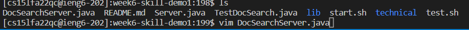
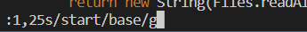
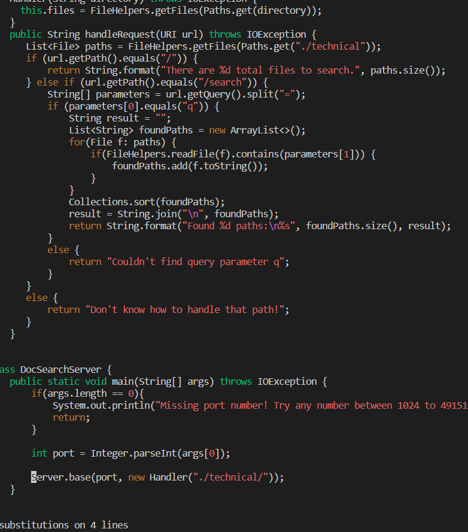
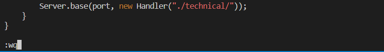

# Lab-report 4
## Part-1 In DocSearchServer.java, change the name of the start parameter of getFiles, and all of its uses, to instead be called base.

I will use the easiest way to replace all the start into base.
### the first step is to open the java file DocSearchServer.java using vim

After we use vim open the document, we will find the code shows up in the screen.

Hence, we can see all the code in ths DocSearchServer.java.
Then, we use the code ```:1,25s/start/base/g```
This command has four separate part. The first part is 1,25s which means substitute the first three code and keep the last item. 1,25 means from line 1 to line 25. the second part the is start whcih is the find all  part. We are trying to find all the start in this file. The third part is to substitute. And g is the command to replace all. We replace all the start with base. Hnece we can find all the code of start and replace them with base. 

we can see in this picture. After I press enter, all the start has been replaced with base.

Finally, never forget to use :wq to save and quit this file.

### step 2
Now, after I have a breif description of what I did. Let's write it out in a formal way.
1. vim DocSearchServer.java <Enter>
2. <shift>+; to get :1,25s/start/base/g <Enter>
3. <shift>+; to get :wq <Enter>

and this is all the command I use for the task. After I counted it, I totally pressed 24 keys if we don't count vim DocSearchServer.java.

# Part 2

To use the scp to copy the DocSearchServer.java onto the remote server


I use scp method and it took me 1:09 mins.

When I use the vim method it only takes me 34 seconds.


As you can see, the second method only takes me 34 seconds. Since it is much faster than the first method. I still think that still need to be based on the condition. Hence, using what method depend on what we need to do.