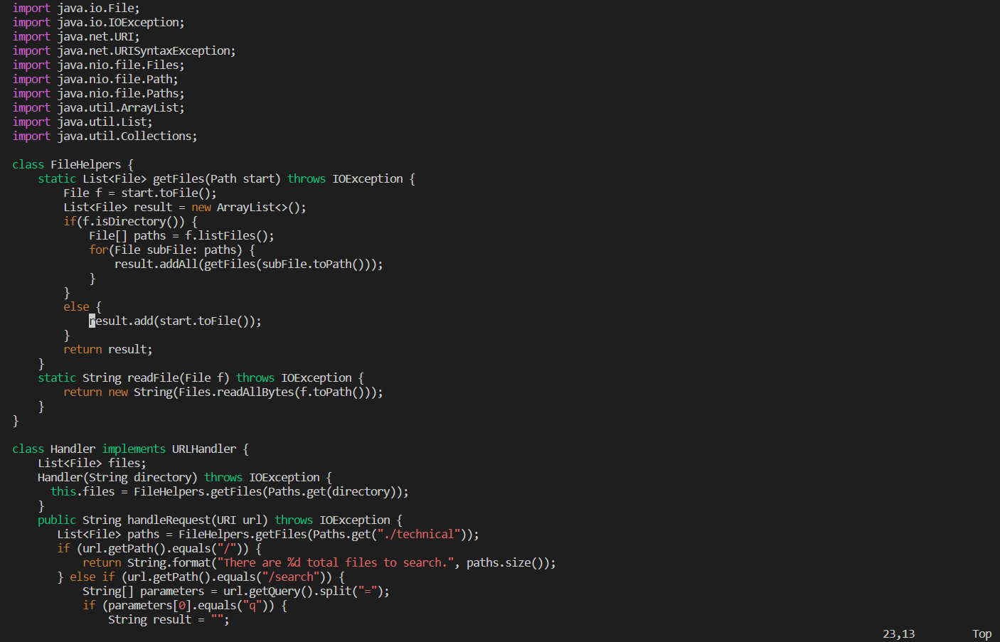
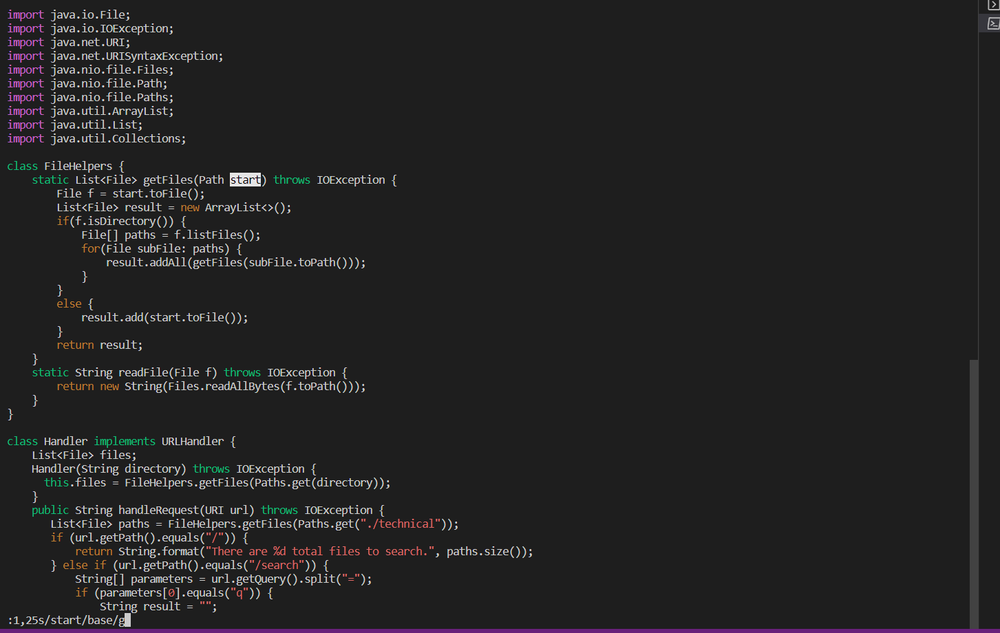
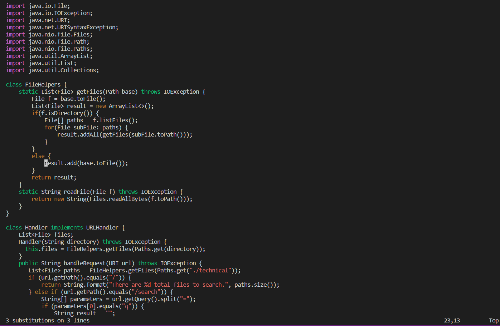
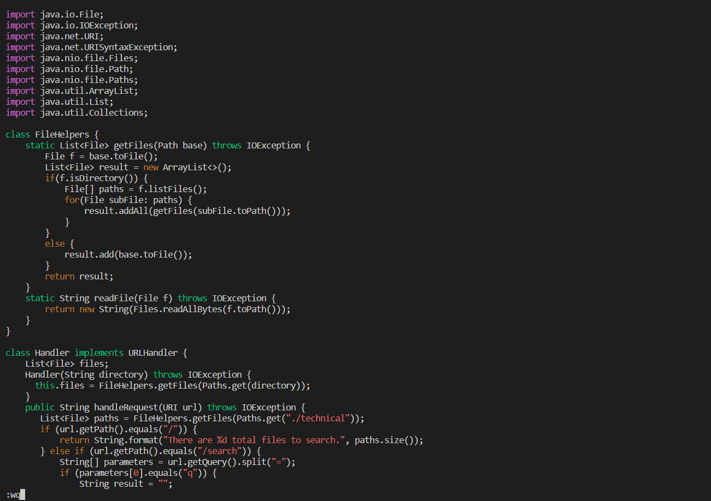
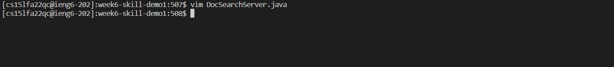
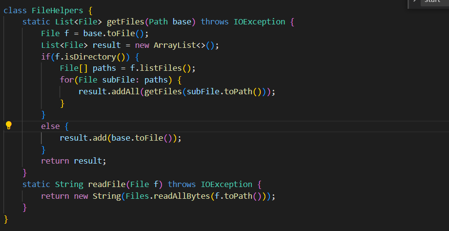
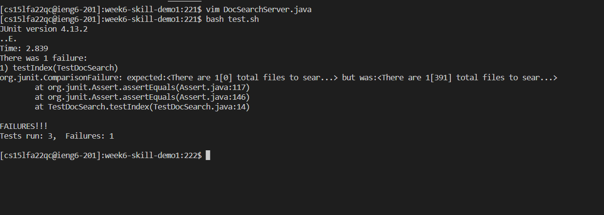

# Lab-report 4
## Part-1 In DocSearchServer.java, change the name of the start parameter of getFiles, and all of its uses, to instead be called base.

I will use the easiest way to replace all the start into base.

### command Line: `/vim DocSearchServer.java<enter>:1,25s/start/base/g<Enter>:wq<Enter>`
1. 
After I type vim DocSearchServer.java with enter, the screenshots shows the code of the file. The cursor automatically move at r of result.

2. 
When I type :1,25s/start/base/g, the cursor move to the first start in the document 

3. 
After I press enter, the start from line 1 to 25 change to base, and the cursor move to r.

4. 
This is when I type :wq without enter, the cursor move after the q

5. 
Finally, when I press enter, the vim closed and the file save the change and quit

# Part 2

To use the scp to copy the DocSearchServer.java onto the remote server

I use scp method and it took me 1:09 mins.

When I use the vim method it only takes me 34 seconds.

As you can see, the second method only takes me 34 seconds. Since it is much faster than the first method. I still think that still need to be based on the condition. Hence, using what method depend on what we need to do.