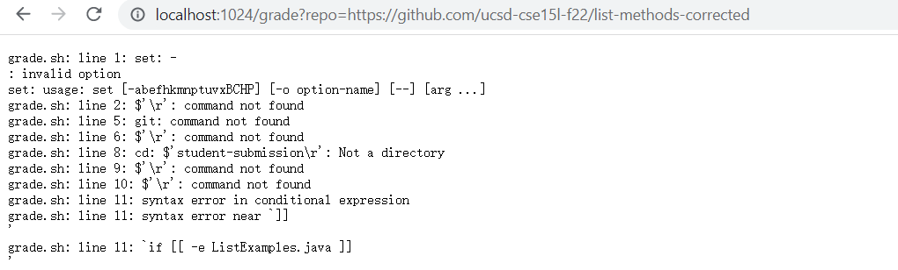
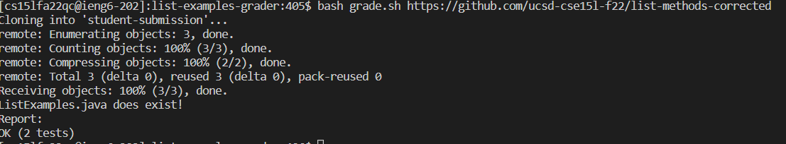
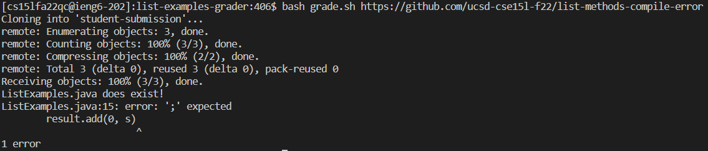
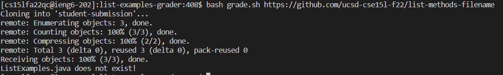

## Lab Report 5
code:
```
set -e

rm -rf student-submission
JU=".:../lib/hamcrest-core-1.3.jar:../lib/junit-4.13.2.jar"
git clone $1 student-submission

cp TestListExamples.java student-submission
cd student-submission


if [[ -e ListExamples.java ]]
then
echo "ListExamples.java does exist!"
else
echo "ListExamples.java does not exist!"
exit 1
fi

javac -cp $JU *.java
java -cp $JU org.junit.runner.JUnitCore TestListExamples > result.txt
echo "Report:"

if [[ $? -eq 0 ]]
then 
grep "OK" result.txt
exit 0
else
grep "Test run:" result.txt
exit 1
fi
```
## screenshoots

I am sorry that my computer is using windows system and it cannot use bash in my computer. I tried to figure it out but it still look like this. Hence, I run bash on the remote server to simulate the reuslt on the broser.




## https://github.com/ucsd-cse15l-f22/list-methods-corrected I choose this one.

```
set -e
```
this line is just making sure that if the code has some problem, it will keep running and throw an exception.

```
rm -rf student-submission
```
case each time we bash the script, we will create a new studen-submission, we need to remove it at the beginning of the code

```
JU=".:../lib/hamcrest-core-1.3.jar:../lib/junit-4.13.2.jar"
```
this is creating a variable which store the junit test command

```
git clone $1 student-submission
```
this is the command to clone the student-submission. $1 need to be substitued by the link https://github.com/ucsd-cse15l-f22/list-methods-corrected
```
cp TestListExamples.java student-submission
cd student-submission
```
we need to copy the test file into the folder
since we are at list-examples-grader file, we need to enter the student-submission folder

```
if [[ -e ListExamples.java ]]
then
echo "ListExamples.java does exist!"
else
echo "ListExamples.java does not exist!"
exit 1
fi
```

for this example, the echo is 0 since the file ListExamples.java exist
the if statement is true, so it will return ListExamples.java does exist!

```
javac -cp $JU *.java
java -cp $JU org.junit.runner.JUnitCore TestListExamples > result.txt
echo "Report:"
```
for these lines, we are compiling all the files and the junit test files. it will also run these files. 
```
if [[ $? -eq 0 ]]
then 
grep "OK" result.txt
exit 0
else
grep "Test run:" result.txt
exit 1
fi
```
for these lines, the if statement return true since all the test passed and there are no error. Hence, we return ok with the result.txt which is (2 Tests!)
